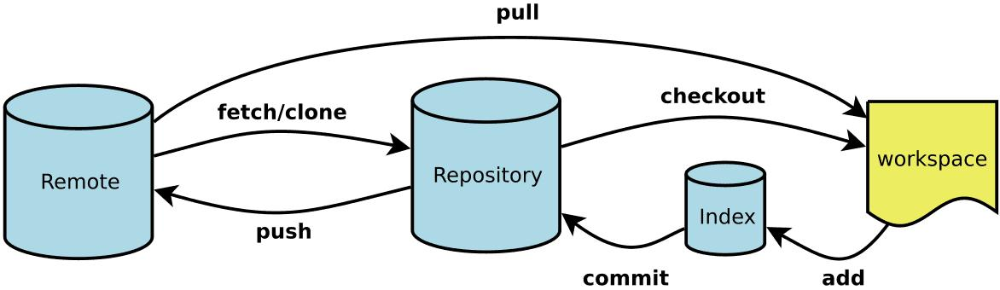

[](https://git-scm.com/)

### 配置篇

#### Git 仓库用户凭据

场景: 使用 https 方式与远程仓库同步时, 不想每次都在提示框中输入用户名和密码确认, 此方式在用户家目录下创建(修改) .git-credentials 文件, 存储用户名和密码

```bash
  git config --system --unset credential.helper # 清除本地存储的用户名和密码凭据
  git config --global credential.helper store # 存储凭据, 在第一次 push 时提示输入
```

#### Git 环境定制

- local 读取仓库配置文件 `.git/config`
- global 读取用户配置文件 `.gitconfig`

```bash
  git config [--local|--global] -l|--list # 显示配置项, 不指定 [] 则显示全部
  git config [--global] -e|--edit  # 使用 vim 编辑配置文件, 默认编辑仓库配置文件
```

##### unset 重置

```bash
  git config [--global] --unset [key] # 删除指定设置, 默认为仓库
  git config --unset user.name # 删除仓库用户名
```

##### add 添加配置

```bash
  git config [--global] --add key value # 设置仓库配置, 默认为仓库
  git config --add user.name Tom # 设置仓库用户名为 Tom
```

##### get 获取配置

```bash
  git config [--global] --get key # 获取指定配置, 默认为仓库
  git config --get user.name # 获取用户名 Tom
```

##### alias 命令缩写

```bash
  git config [--global] alias.* value # 设置命令缩写, 默认为仓库
  git config alias.co checkout # 设置 checkout 的缩写命令为 co
```

###### alias.log 美化

```bash
  git config [--global] alias.lg "log --color --graph --pretty=format:'%Cred%h%Creset -%C(yellow)%d%Creset %s %Cgreen(%cr) %C(bold blue)<%an>%Creset' --abbrev-commit" # 设置 log 缩写并美化输出提交记录
```

- %H commit hash
- %h commit short hash
- %T tree hash
- %t tree short hash
- %P parent hash
- %p parent short hash
- %a[n|N] 作者名字
- %a[e|E] 作者邮箱
- %a[d|D|r|t|i] 日期格式
- %c[n|N] 提交者名字
- %c[e|E] 提交者邮箱
- %c[d|D|r|t|i] 提交的日期格式
- %d ref 名称
- %e encoding
- %s commit 信息标题
- %f 过滤 commit 信息的标题使之可以作为文件名
- %b commit 信息内容
- %N commit notes
- %g[D|d] reflog selector
- %gs reflog subject
- %Cred 切换至红色
- %Cgreen 切换至绿色
- %Cblue 切换至蓝色
- %Creset 重设颜色
- %C(color) 指定颜色
- %n 换行
- %m left right or boundary mark
- %%a raw %
- %x00 print a byte from a hex code
- %w([[,[,]]]) switch line wrapping, like the -w option of git-shortlog(1).

##### remote 设置

```bash
  git remote -v|--verbose # 显示关联的远程仓库的详细信息
```

###### add 添加

```bash
  git remote add name url # 添加关联的远程仓库信息
```

###### remove 删除

```bash
  git remote remove name # 删除关联的远程仓库信息
```

###### rename 修改关联仓库名称

```bash
  git config remote rename old new # 修改关联的远程仓库名称
```

###### set-url 设置关联仓库地址

- push 设置推送 url
- add 保持当前的 url,并添加一个新的 url
- delete 将删除匹配到的 url, 并添加一个新的 url

```bash
  git config remote set-url [--push|--add|--delete] name url # 设置关联仓库地址
```

###### get-url 获取关联仓库地址

- push 获取推送 url
- all 获取所有 url

```bash
  git config remote get-url [--push|--all] name # 获取关联仓库地址
```

### 操作篇

#### 初始化

```bash
  git init [project-name] # 初始化 指定/当前 目录为 git 仓库
```

#### 克隆

```bash
  git clone [url] # 下载远程仓库和历史记录
```

#### 分支

### 外篇
