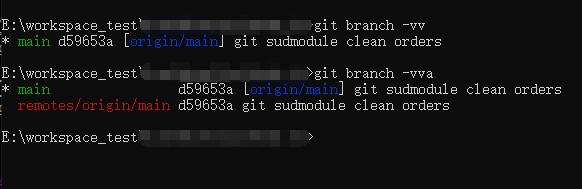
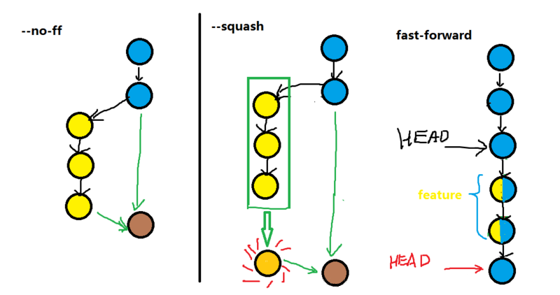
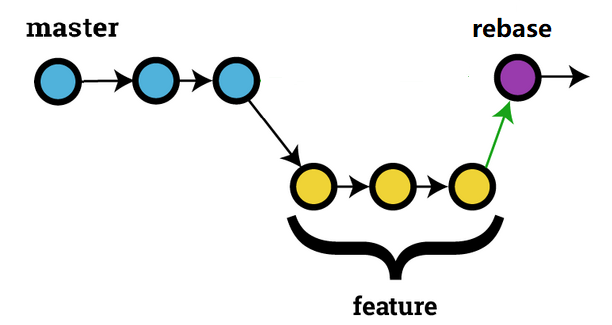
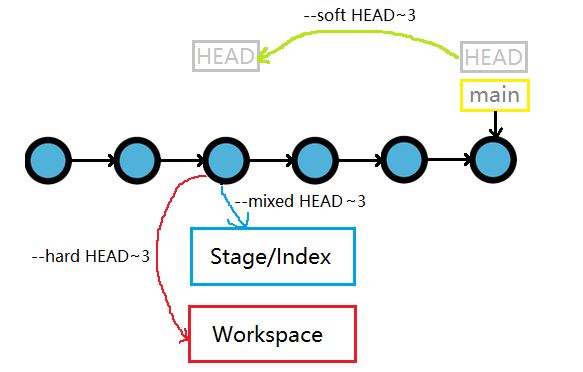
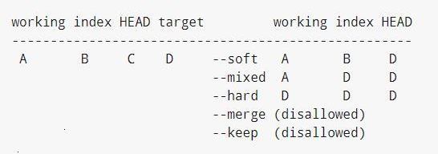
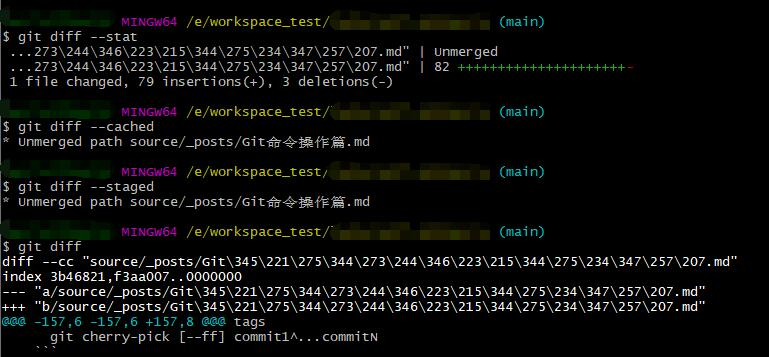
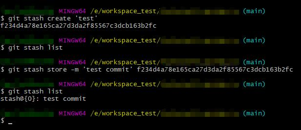

### 操作篇

#### 初始化仓库

```bash
  git init [project-name]
```

#### 克隆仓库

```bash
  git clone [url]
```

#### 分支

##### 查看

- a|all: 列出所有本地和关联远程分支
- r: 列出关联远程分支
- v|verbose: 列出分支并显示当前提交信息摘要

  ```bash
    git branch [-a] [-r] [-v]
  ```

<!-- more -->

##### 新建

```bash
  git branch <branch-name>
```

##### 移动|修改

- m: 移动|修改分支, old-branch 无则为移动操作
- M: 强制移动|修改分支即使新分支存在, old-branch 无则为移动操作

  ```bash
    git branch [-m] [-M] [<old-branch>] <new-branch>
  ```

##### 复制

- c: 复制分支和分支提交历史
- C: 强制复制分支和分支提交历史

  ```bash
    git branch [-c] [-M] [<old-branch>] <new-branch>
  ```

##### 删除

- d: 删除本地分支,一般和 r 配合删除关联远程分支
- D: 强制删除本地分支, 即使分支未被合并

  ```bash
    git branch [-d] [-D] <branch-name>
  ```

##### 切换

```bash
  git checkout [branch-name]
```

###### 切换并创建新分支

基于远程分支创建新分支,自动建立追踪关系

```bash
  git checkout -b <branch-name> [-t] [<remote-branch>]
```

##### 分支追踪关系

- t|no-track: 建立|取消分支追踪关系
- u|unset-upstream: 建立|取消分支追踪关系

###### 当前分支和远程分支建立追踪关系

```bash
  git branch -t <remote-branch>
```

###### 指定分支和远程分支建立追踪关系

```bash
  git branch -u <local-branch> <remote-branch>
```

##### 分支追踪关系,提交摘要

```bash
  git branch [-vv]
```



##### 分支合并

###### merge

- fast-forward(ff): 快速合并, 不创建新的 commit, 原分支删除后提交记录消失, 默认方式
- no-ff: 不快速合并, 保留原有分支记录, 创建新的 commit
- squash: 合并一些不必要的 commit, 创建新的 commit
- stat: 合并结束后统计显示区别
- continue: 解决冲突后结束合并
- abort: 中断解决冲突结束合并
- quit: 放弃合并

```bash
  git merge [--no-ff] <branch-name>
```



###### rebase

- i|interactive: 交互式操作
- continue: 解决冲突后结束合并
- abort: 中断解决冲突结束合并
- quit: 放弃合并
- skip: 重启合并跳过当前的修改

```bash
  git rebase <branch-name>
```



###### 选择合并

- 选择一个或者多个 commit, 合并进当前分支, 手动 commit

  ```bash
    git cherry-pick [--no-commit|-n] <commit-ish>
  ```

- 选择 commit 区间合并, 含尾不含头

  ```bash
    git cherry-pick [--ff] commit1...commitN
  ```

- 选择 commit 区间合并, 包含头和尾

  ```bash
    git cherry-pick [--ff] commit1^...commitN
  ```

---

#### 文件操作

##### 添加文件

- all|A|. 添加所有文件提交信息列表
- i|interactive: 交互式操作
- n|dry-run: 不执行任何操作, 只显示做什么

```bash
  git add [-A] [-i] [-n] [<file>...]
```

##### 撤销文件

- 撤销工作区文件的变更

  ```bash
    git checkout -- [.|<file>...]
  ```

- 恢复上一个 commit 的所有文件到工作区

  ```bash
    git checkout .
  ```

- 恢复指定 commit 的指定文件到工作区

  ```bash
    git checkout [commit] [file]
  ```

##### 提交

- a|all: git add -A 的缩写
- m|message: commit 的注释
- amend: 改写上一次 commit 的注释

```bash
  git commit [-am] [<file>...]
```

##### 版本变更

###### reset

- mixed: 还原版本库和暂存区, 工作区保持不变, 默认方式
- soft: 还原版本库, 暂存区和工作保持不变
- hard: 还原版本库和暂存区和工作区
- keep: 还原版本库和暂存区, 并更新工作区中的 commit 和 HEAD 之间不同的文件, 如果不同的文件本地有更改则中止
- merge: 还原版本库和暂存区, 并更新工作区中的 commit 和 HEAD 之间不同的文件, 但保留暂存区和工作区中不同的文件(既有未添加的更改), 如果不同的文件有未暂存的更改则中止

  ```bash
    git reset 3f405f2
    git reset --soft HEAD^
    git reset --hard HEAD~3
  ```




- 其他参数区别参见 git reset \-\-help

###### revert

撤销一个或多个 commit, 并手动提交 commit

```bash
  git revert [--no-commit|-n] [<commit-ish>...]
```

---

##### 标签

- d|delete: 删除指定标签
- l|list: 显示所有标签列表
- show: 查看指定标签信息

  ```bash
    git tag [-l]
    git show [<tag-name>]
  ```

###### 创建 tag

```bash
  git tag [<tag-name>] [<commit>]
```

###### 提交 tag

```bash
  git push [<remote>] [<tag-name>]
  git push [<remote>] --tags
```

###### 删除 tag

- 删除本地 tag

  ```bash
    git tag [-d] [<tag-name>]
  ```

- 删除远程 tag

  ```bash
    git push [<remote>] [--delete] <tag-name>
    git push [<remote>] :refs/tags/<tag-name>
  ```

---

##### 比较

- stat: 统计不同数量
- cached: 比较暂存区和指定 commit 的差异
- staged: 比较暂存区和版本库的差异
- check: 列出找到可能的空白错误
- path: 指定 commit 之间的文件的差异

  ```bash
    git diff [<commit>] [<commit>] [--] [<path>]
  ```

###### 工作区和版本库的差异

```bash
  git diff HEAD
```

###### 暂存区和工作区的差异

```bash
  git diff
```

###### 暂存区和版本库的差异

```bash
  git diff [--staged]
```

###### 暂存区和指定 commit 的差异

```bash
  git diff [--cached] [<commit>]
```



---

#### 暂存

保存当前工作区的状态以备以后继续使用并恢复干净的工作区

- list: 显示暂存区暂存记录
- show: 显示暂存区最新的记录和当前工作区的不同
- pop: 取出指定的 stash 还原到工作区中并从暂存区中移除
- apply: 取出指定的 stash 还原到工作区不从暂存区移除
- clear: 清空暂存区
- drop: 从暂存区移除指定的 stash
- create: 基于当前工作区状态创建一个 stash 对象并返回 commit
- store: 使用返回的 commit 生成 stash 记录

```bash
  git stash
  git stash list
  git stash show|pop|apply|drop [<stash@{0}>]
  git stash clear
  git stash create [<message>]
  git stash store [-m <message>] <commit>
```



---

#### 日志

##### 查看文件状态

```bash
  git status
```

##### 历史记录

- all: 显示所有分支历史记录
- stat: 统计每个 commit 的差异数量
- follow: 显示指定文件的历史记录
- summary: 显示每个 commit 的具体操作
- p: 显示每个 commit 文件的修改详情
- graph: 图形化显示历史记录
- oneline: 每条历史记录独占一行

  ```bash
    git log [<remote>]
    git log --stat
    git log -p [<commit>] [<file>]
  ```

---

#### 远程同步

##### pull 拉取远程分支信息并执行合并

```bash
  git pull [<remote>] [<remote-branch-name>[:<local-branch-name>]]
```

- all: 获取远程所有分支

  ```bash
    git pull [--all]
  ```

- stat: 统计合并后的差异

  ```bash
    git pull [--stat] [<remote>] [<remote-branch-name>[:<local-branch-name>]]
  ```

- no-ff: 不执行快速合并

  ```bash
    git pull [--no-ff] [<remote>] [<remote-branch-name>[:<local-branch-name>]]
  ```

- t|tags: 获取远程的 tags, 默认

  ```bash
    git pull [-t] [<remote>] [<remote-branch-name>[:<local-branch-name>]]
  ```

- no-tags: 不拉取远程的 tags

  ```bash
    git pull [--no-tags] [<remote>] [<remote-branch-name>[:<local-branch-name>]]
  ```

- set-upstream: 建立追踪关系

  ```bash
    git pull [--set-upstream] [<remote>] [<remote-branch-name>[:<local-branch-name>]]
  ```

##### fetch 拉取远程分支信息

- all: 获取所有远程分支

  ```bash
    git fetch [-all]
  ```

- t|tags: 获取远程的 tags, 默认

  ```bash
    git fetch [-t] [<remote>] [<remote-branch-name>]
  ```

- no-tags: 不拉取远程的 tags

  ```bash
    git pull [--no-tags] [<remote>] [<remote-branch-name>]
  ```

##### push 推送本地分支信息到远程

```bash
  git push [<remote>] [<local-branch-name>[:<remote-branch-nam>]]
```

- all: 推送所有的分支

  ```bash
    git push [--all]
  ```

- f|force: 强制推送分支信息

  ```bash
    git push [-f] [<remote>] [<local-branch-name>[:<remote-branch-nam>]]
  ```

- d|delete: 删除远程分支

  ```bash
    git push [-d] [<remote>] [<remote-branch-name>]
    git push [<remote>] [:[<remote_branch_name>]]
  ```

- tags: 推送标签信息

  ```bash
    git push [<remote>] [<tag-name>]
    git push [<remote>] [--tags]
    git push [<remote>] :refs/tags/[<tag-name>]
  ```

- u|set-upstream: 建立分支追踪

  ```bash
    git push [-u] [<remote>] [<remote-branch-name>]
  ```

---
