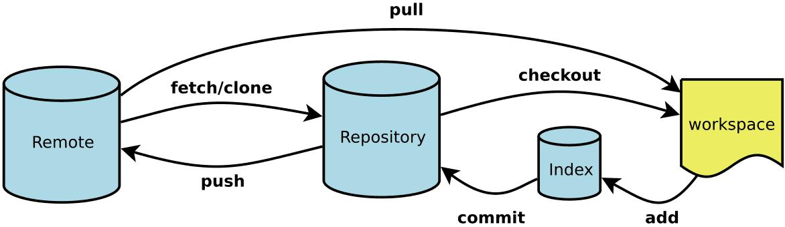
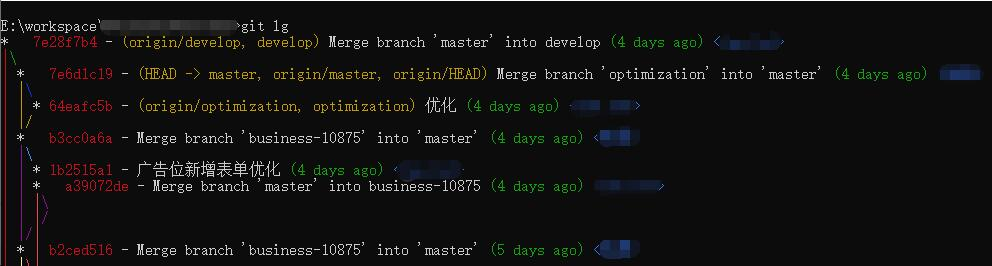

[](https://git-scm.com/)

### 配置篇

#### 概念

##### Remote

远程仓库, 托管代码的服务器, 团队协作开发时都与此进行同步

##### Repository

本机仓库(或版本库), 管理所有被提交的代码版本, 其中 HEAD 指向最新放入仓库的版本

##### Index / Stage

暂存区, 临时存放改动的需要被提交的文件列表信息

##### Workspace

工作区, 当前可见的随时可以进行操作的区域

#### Git 仓库用户凭据

场景: 使用 https 方式与远程仓库同步时, 不想每次都在提示框中输入用户名和密码确认, 此方式在用户家目录下创建(修改) .git-credentials 文件, 存储用户名和密码

- 清除本地存储的用户名和密码凭据

  ```bash
    git config --system --unset credential.helper
  ```

- 存储凭据, 在第一次 push 时提示输入

  ```bash
    git config --global credential.helper store
  ```

#### Git 环境定制

- local: 读取仓库配置文件 `.git/config`
- global: 读取用户配置文件 `.gitconfig`, 不加默认为仓库配置

##### 显示配置项

```bash
  git config [--local|--global] -l|--list
```

##### 使用 vim 编辑配置文件

```bash
  git config [--local|--global] -e|--edit
```

##### unset 重置

```bash
  git config [--global] --unset [key]
```

##### add 添加配置

```bash
  git config [--global] --add key value
  git config --add user.name Tom
```

##### get 获取配置

```bash
  git config [--global] --get key
  git config --get user.name
```

##### alias 命令缩写

```bash
  git config [--global] alias.* value
  git config alias.co checkout
```

###### alias.log 美化

- %H commit hash
- %h commit short hash
- %T tree hash
- %t tree short hash
- %P parent hash
- %p parent short hash
- %a[n|N] 作者名字
- %a[e|E] 作者邮箱
- %a[d|D|r|t|i] 日期格式
- %c[n|N] 提交者名字
- %c[e|E] 提交者邮箱
- %c[d|D|r|t|i] 提交的日期格式
- %d ref 名称
- %e encoding
- %s commit 信息标题
- %f 过滤 commit 信息的标题使之可以作为文件名
- %b commit 信息内容
- %N commit notes
- %g[D|d] reflog selector
- %gs reflog subject
- %Cred 切换至红色
- %Cgreen 切换至绿色
- %Cblue 切换至蓝色
- %Creset 重设颜色
- %C(color) 指定颜色
- %n 换行
- %m left right or boundary mark
- %%a raw %
- %x00 print a byte from a hex code
- %w([[,[,]]]) switch line wrapping, like the -w option of git-shortlog(1).

  ```bash
    git config [--global] alias.lg "log --color --graph --pretty=format:'%Cred%h%Creset -%C(yellow)%d%Creset %s %Cgreen(%cr) %C(bold blue)<%an>%Creset' --abbrev-commit"
  ```



##### remote 设置

```bash
  git remote -v|--verbose
```

###### add 添加

```bash
  git remote add name url
```

###### remove 删除

```bash
  git remote remove name
```

###### rename 修改关联仓库名称

```bash
  git remote rename old new
```

###### set-url 设置关联仓库地址

- push: 设置推送 url
- add: 保持当前的 url,并添加一个新的 url
- delete: 将删除匹配到的 url, 并添加一个新的 url

  ```bash
    git remote set-url [--push|--add|--delete] name url
  ```

###### get-url 获取关联仓库地址

- push: 获取推送 url
- all: 获取所有 url

  ```bash
    git remote get-url [--push|--all] name
  ```

---
