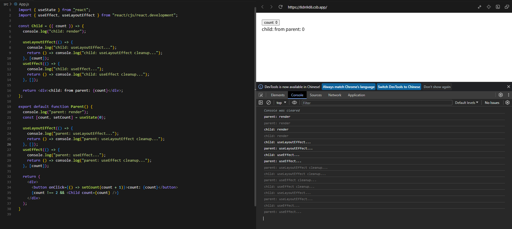
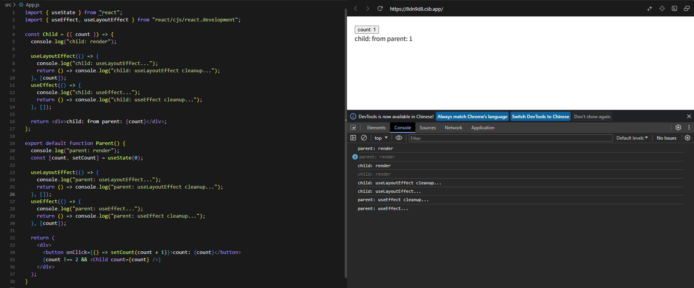
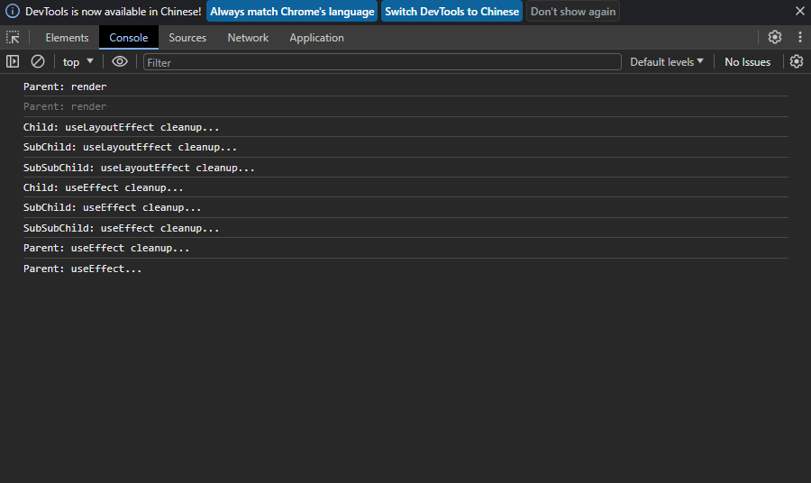

## React

React 18.3.1

## 设计思想

- 变换, 设计 React 的核心前提是认为 UI 只是把数据通过映射关系变换成另一种形式的数据。同样的输入必会有同样的输出。这恰好就是纯函数。
- 抽象, 需要把 UI 抽象成多个隐藏内部细节，又可复用的函数。通过在一个函数中调用另一个函数来实现复杂的 UI
- 组合, 将两个或者多个不同的抽象通过组合再次抽象成一个抽象

不变性, 不直接操作数据源, 副本替换

- 可以保持以前版本的数据完好无损, 并在以后重用它们
- 使组件比较其数据是否已更改的成本非常低, 提高子组件的渲染性能

状态

- 只有当在组件树中 相同的 位置渲染 相同的 组件时, React 才会一直保留着组件的 state
- 在一般安全的情况下采用批处理方式处理 state 更新

- 使用不可变的数据模型, 把可以改变 state 的函数串联起来作为原点放置在顶层

- 状态不存在于组件内, 状态是由 React 保存的, React 通过组件在渲染树中的位置将它保存的每个状态与正确的组件关联起来

  - 这个变量是否通过 props 从父组件中获取，如果是，则不是一个状态
  - 这个变量是否在组件的整个生命周期中都保持不变，如果是，则不是一个状态
  - 这个变量是否可以通过其他状态(state)或者属性(props)计算得到，如果是，则不是一个状态
  - 这个变量是否在组件的 render 方法中使用，如果不在，则不是一个状态

不能直接声明 async 函数式组件

- 返回类型不匹配, React 组件需要返回 React 元素(JSX), 而 async 函数默认返回一个 Promise, 导致 React 无法正确渲染组件
- 生命周期和状态管理, 异步操作通常涉及到副作用, 这些不应该在组件的渲染阶段进行, 它们应该在组件的生命周期方法或者特定的钩子中

```javascript
// state
let count = 0;
let prevCount = count;
// events
window.addEventListener("click", () => { count++ }, false);
// render
const render = () => {
  document.body.innerHTML = count;
}
// diff
const reconcile = () => {
  if (prevCount !== count) {
    render();
    prevCount = count;
  }
}
// scheduler
const workloop = () => {
  reconcile()
  // window.scheduler.postTask(() => { //... })
  // 为什么 react 官方不使用这个 API
  // 因为 requestIdleCallback, scheduler.postTack 无法满足优先级调用, 
  // 有了优先级, 就可以知道当下什么任务最紧急
  window.requestIdleCallback(() => {
    workloop();
  })
}
workloop();
```

### 并发 React

React 在底层实现上使用了非常复杂的技术, 如优先队列，多级缓冲. 使得 React 能够同时准备多个版本的 UI.

`并发渲染`的关键特性是渲染可中断, React 即使渲染被中断, UI 也会保持一致, 它会在整个 DOM 树被计算完毕前一直等待, 完毕后再执行 DOM 变更. 这样做, React 就可以在后台提前准备新的屏幕内容, 而不阻塞主线程. 这意味着用户输入可以被立即响应, 即使存在大量渲染任务, 也能有流畅的用户体验.

### 自动批处理

当 React 在一个单独的重渲染事件中批量处理多个状态更新以此实现优化性能. 没有自动批处理的话, 仅能够在 React 事件处理程序中批量更新.

在 React 18 之前, 默认情况下 promise、setTimeout、原生应用的事件处理程序以及其他任何事件中的更新都不会被批处理.

```tsx
// React 18 之前: 只有 React 事件会被批处理
setTimeout(() => {
  setCount(c => c + 1);
  setFlag(f => !f);
  // React 会渲染两次, 每次更新一个状态(没有批处理)
}, 1000);

// React 18 之后: React 事件, promise, setTimeout, 原生事件, 其他任何事件都被批处理
setTimeout(() => {
  setCount(c => c + 1);
  setFlag(f => !f);
  // React 仅会重渲染一次(批处理);
}, 1000);
```

<!--more-->

### Actions

> React 19 支持

一个异步函数, 执行数据变更然后响应更新状态, [useTransition](#useTransition), [useActionState](#useActionState), [useOptimistic](#useOptimistic)

### 构建 state 原则

- 合并关联的 state, 如果总是同时更新两个或更多的 state 变量时, 考虑将它们合并为一个单独的 state
- 避免互相矛盾的 state, 当 state 结构中存在多个相互矛盾不一致的 state 时, 应避免这种情况
- 避免冗余的 state, 如果渲染期间从组件的 props 或其它现有的 state 中计算出一些信息, 则不应该作为 state
- 避免重复的 state, 当同一数据在多个 state 之间或多个嵌套对象中重复时, 这很难保持它们同步, 应避免这种情况
- 避免深度嵌套的 state, 深度分层的 state 更新起来很不方面, 尽量以扁平化方式构建 state

- 尽量避免在 state 中镜像 props, 会与从父组件传递的属性失去同步(将不会更新), 只有想要忽略特定 props 属性的所有更新时, 使用镜像 props 才有意义, 约定 prop 名称以 `initial` 或 `default` 开头, 以说明该 prop 的新值将被忽略

### 响应式值

props 和 state 并不是唯一的响应式值, 从它们计算出的值都是响应式的, 如果 props 或 state 发生变化, 组件将重新渲染, 从中计算出的值也会随之变化, 所以需要将响应式值包括在 Effect 的依赖项中

- 所有在组件内部直接声明的变量和函数

### 对 state 进行保留和重置

- 将组件渲染在不同的位置, 可以重置 state
- 使用 key 重置 state, key 不是全局唯一的, 只是标识父组件内部的顺序

```jsx
import { useState } from 'react';

export default function Scoreboard() {
  const [isPlayerA, setIsPlayerA] = useState(true);
  /* 如果只用一个 Counter 组件通过 props 传递 person 属性的方式切换用户会出现 state 不会被重置*/
  return (
    <div>
      {/* 第 1 种方式: 在不同位置上, 渲染两个 Counter 组件, 在切换不同的用户时可以重置 state */}
      {isPlayerA && <Counter person="Taylor" />}
      {!isPlayerA && <Counter person="Sarah" /> }

      {/* 第 2 种方式: 在同一位置上, 使用 key 为 Counter 组件添加标识, 让 React 区分组件 */}
      {isPlayerA 
        ? (<Counter key="Taylor" person="Taylor" />) 
        : (<Counter key="Sarah" person="Sarah" />)}
      <button onClick={() => setIsPlayerA(!isPlayerA) }>下一位玩家！</button>
    </div>
  );
}
// Counter 组件
function Counter({ person }) {
  const [score, setScore] = useState(0);
  const [hover, setHover] = useState(false);

  let className = 'counter';
  if (hover) {
    className += ' hover';
  }

  return (
    <div 
      className={className}
      onPointerEnter={() => setHover(true)}
      onPointerLeave={() => setHover(false)}
    >
      <h1>{person} 的分数：{score}</h1>
      <button onClick={() => setScore(score + 1)}>加一</button>
    </div>
  );
}
```

## React.Component(deprected)

### 组件的生命周期

- constructor(props)
  - 初始化内部 state，只能在构造函数中直接为 state 赋值，其他方法中应使用 this.setState()
  - 为事件处理函数绑定实例
- static getDerivedStateFromProps(props, state)
  - 在 render() 方法执行前调用, 初始化挂载及后续更新都会被调用
  - 返回一个对象来更新 state, 如果返回 null, 则不更新任何内容
  - 无法访问组件实例
- render() class 组件中唯一必须实现的方法, 返回以下类型之一
  - React 元素
  - 数组或者 Fragments
  - Portals
  - 字符串或者数值类型
  - 布尔类型或者 null,什么都不渲染
- componentDidMount()
  - 组件挂载后立即调，DOM 节点的初始化应该放在这里

- static getDerivedStateFromProps(props, state)
- shouldComponentUpdate(nextProps, nextState)
  - 返回值影响组件是否会重新渲染
  - 默认返回值为 true
  - 首次渲染或者使用 forceUpdate() 时不会调用该方法
  - 返回 false 不会调用 render() 和 componentDidUpdate() 方法
- render()
- getSnapshotBeforeUpdate(prevProps, prevState)
  - 在最近一次渲染输出(提交到 DOM 节点)之前调用
  - 返回值作为 componentDidUpdate 方法的第三个参数 snapshot 传递,否则此参数为 undefined
- componentDidUpdate(prevProps, prevState, snapshot)

- componentWillUnmount() 组件卸载及销毁之前直接调用,此方法中不应该使用 setState() 方法,组件不会被重新渲染

### 迁移到函数式组件

- static contextType 绑定 context, 等同于在函数式组件中使用 [useContext](#useContext)

```jsx
class Button extends Component {
  // 方式1: 静态属性绑定 context;
  // 方式2: 类组件外部绑定 Button.contextType = ThemeContext;
  static contextType = ThemeContext; 
  render() {
    // 类组件中读取 context;
    const theme = this.context;
    const className = 'button-' + theme;
    return (
      <button className={className}>
        {this.props.children}
      </button>
    )
  }
}
// 方式2：类组件外部绑定
// Button.contextType = ThemeContext;

// 等同于函数式组件使用 useContext;
function Button() {
  const theme = useContext(ThemeContext);
  const className = 'button-' + theme;
  return (
    <button className={className}>
      {this.props.children}
    </button>
  )
}
```

- static defaultProps 类组件设置默认 props
  - 当 props 为 undefined 或者缺少时有效(为 null 无效)
  - 类似于函数式组件中使用默认值

```jsx
class Button extends Component {
  static defaultProps = {
    color: 'blue'
  }
  redner() {
    return <button className={this.props.color}>button</button>
  }
}

// 类似于函数式组件使用默认值
function Button({color = 'blue'}){
  return <button className={color}>button</button>
}
```

- static propTypes 类组件的 props 的类型约束, 仅在渲染和开发过程中进行检查, 函数式组件使用 TypeScript

```jsx
import PropTypes from 'prop-types';
class Greeting extends Component {
  static propTypes = {
    name: PropTypes.string
  }
  render() {
    return <h1>Hello, {this.props.name}</h1>
  }
}
```

## 深入 JSX

- 只能返回一个根元素
- 标签必须闭合
- 大部分属性使用驼峰方式
- 自定义的组件必须以大写字母开头

- React 将 boolean, null, undefined 视为空值, 不做任何渲染
- 直接在 JSX 中渲染对象 React 将报错 (not valid React element)

### 生命周期

#### 挂载阶段

组件首次挂载时 `由内而外` 先依次执行 `layoutEffect` 的 setup, 然后再依次执行 `effect` 的 setup

1. 父组件函数体执行(包括所有 Hook 初始化)
2. 子组件函数体执行(包括所有 Hook 初始化)
3. 子组件 useLayoutEffect 执行
4. 父组件 useLayoutEffect 执行
5. 子组件 useEffect 执行
6. 父组件 useEffect 执行



#### 更新阶段

组件更新时 `由内而外` 先依次执行有依赖变化的 `layoutEffect` 的 cleanup 和 setup, 然后再依次执行有依赖变化的 `effect` 的 cleanup 和 setup

1. 父组件函数体执行
2. 子组件函数体执行
3. 子组件 useLayoutEffect cleanup 执行(如果有依赖变化)
4. 父组件 uselayoutEffect cleanup 执行(如果有依赖变化)
5. 子组件 useLayoutEffect 执行(如果有依赖变化)
6. 父组件 useLayoutEffect 执行(如果有依赖变化)
7. 子组件 useEffect cleanup 执行(如果有依赖变化)
8. 父组件 useEffect cleanup 执行(如果有依赖变化)
9. 子组件 useEffect 执行(如果有依赖变化)
10. 父组件 useEffect 执行(如果有依赖变化)



#### 卸载阶段

组件卸载时, 从卸载组件开始 `由外而内` 先依次执行 `layoutEffect` 的 cleanup, 然后再依次执行 `effect` 的 cleanup

1. 父组件 useLayoutEffect cleanup 执行
2. 子组件 useLayoutEffect cleanup 执行
3. 父组件 useEffect cleanup 执行
4. 子组件 useEffect cleanup 执行



### 使用 TypeScript

- DOM 事件, React.SyntheticEvent 是所有事件的基类型
- 子元素
  - 使用 React.ReactNode 类型作为子元素传递的所有可能类型的并集
  - 使用 React.ReactElement 类型, 它只包含 JSX 元素, 而不包括 JS 原始类型, 例如 string 或 number

```tsx
interface ModalRendererProps {
  title: string;
  children: React.ReactNode;
}
interface ModalRendererProps {
  title: string;
  children: React.ReactElement
}
```

- 样式属性, 使用 React.CSSProperties 来描述传递给 style 属性的对象, 这个类型是所有可能的 css 属性的并集

```tsx
interface MyComponentProps {
  style: React.CSSProperties;
}
```

### JSX 中的 Props

- JavaScript 表达式作为 Props

- 字符串字面量

```jsx
// 两个JSX表达式是等价的,
<MyComponent message="hello world" />
<MyComponent message={'hello world'} />
// 字符串字面量赋值给 prop 时，它的值是未转义的
<MyComponent message="&lt;3" />
<MyComponent message={'<3'} />
```

- Props 默认值为 True

```jsx
<MyTextBox autocomplete />
<MyTextBox autocomplete={true} />
```

- 属性展开

```jsx
// 此方法容易将不必要的 props 传递给不相关的组件，
// 或者将无效的 HTML 属性传递给 DOM,谨慎使用该语法.
const Button = (props) => {
  const { kind, ...other } = props;
  const className = kind === 'primary' ? 'PrimaryButton' : 'SecondaryButton';
  return <button className={className} {...other} />;
};

const App = () => {
  return (
    <div>
      <Button kind='primary' onClick={() => console.log('clicked!')}>
        Hello World!
      </Button>
    </div>
  );
};
```

### JSX 中的 children

- 包含在开始和结束标签之间的 JSX 内容将作为特定属性 props.children 传递给组件.

```jsx
function MyComponent({title, children}){
  return (
    <div title={title}>
      {children}
    </div>
  )
}
function App(){
  return (
    <MyComponent title='my-component'>
      This is children
      <p>tag p</p>
    </MyComponent>
  )
}
```

- 批量子元素

```jsx
// 调用子元素回调 numTimes 次，来重复生成组件
function Repeat(props) {
  let items = [];
  for (let i = 0; i < props.numTimes; i++) {
    items.push(props.children(i));
  }
  return <div>{items}</div>;
}

function ListOfTenThings() {
  return <Repeat numTimes={10}>{(index) => <div key={index}>This is item {index} in the list</div>}</Repeat>;
}
```

## React Hook

一个特殊的函数, 只能在组件或自定义 Hook 的顶层调用

- React 16.8 新增
- 可以在函数组件内"钩入" React State 及生命周期等特性的函数
- 不能在 class 组件中使用

### Hook 规则

- 只能在函数最顶层调用 Hook, 不能在循环、条件判断或者嵌套函数中调用
- 只能在 React 的函数组件中调用 Hook, 不能在其他 JavaScript 函数中调用
- 对 Hook 的每个调用完全独立于对同一个 Hook 的其他调用

### React 内置 Hook

#### useId <em id="useId"></em> <!--markdownlint-disable-line-->

生成传递给无障碍属性的唯一 ID, 不应该被用来生成数据列表中的 key, key 的值在兄弟节点之间必须是唯一的, key 值不能改变

- 能够确保与服务器端渲染一起工作

```jsx
const id = useId();
```

```jsx
import {useId} from 'react';

function PasswordFiled(){
  const passwordHintId = useId();

  return (
    <>
      <input type="password" aria-describedby={passwordHintId}/>
      <p id={passwordHintId}>密码至少包含 18 个字符</p>
    </>
  )
}
```

#### useState

- 用于保存渲染间的数据
- 更新变量并触发 React 再次渲染组件
- 调用 set 函数不会改变已经执行的代码中当前的 state

```jsx
const [state, setState] = useState(initialState);
```

```jsx
// useState 实现原理
let componentHooks = []; // 把 state 存储在外面
let currentHookIndex = 0;

function useState(initialValue) {
  let pair = componentHooks[currentHookIndex];
  if(pair){
    currentHookIndex++;
    return pair;
  }

  // 第一次渲染时
  let setState = function (nextState) {
    pair[0] = nextState;
    updateDOM(); // 更新DOM
  }
  pair = [initialValue, setState];

  // 存储这个 pair 用于将来的渲染
  // 并且为下一次 hook 的调用做准备
  componentHooks[currentHookIndex] = pair;
  currentHookIndex++;
  return pair;
}
```

- 初始 state 参数只在第一次渲染时会被用到

```jsx
import {useState} from 'react';

const [count, setCount] = useState(0);
const [fruit, setFruit] = useState('banana');
const [todos, setTodos] = useState([{ text: 'learn React Hooks' }]);
setTodos([...todos, { text: 'Hello setTodos' }]); // 和 this.setState 的区别: 不会进行 state 合并
```

- 函数式更新, 新的 state 需要通过之前的 state 计算得出
- React 将更新函数放入队列中, 在下一次渲染期间, React 将通过队列将所有更新函数应用于先前的状态来计算下一个状态

```jsx
setCount((prevCount) => prevCount - 1);
<button onClick={setCount.bind(null, (prevCount) => prevCount + 1)}>+</button>;
```

- 和当前的 state 合并更新, 如果更新函数返回值和当前 state 完全相同，则重渲染会被跳过

```jsx
setState((prevState) => {
  return { ...prevState, ...updateValues };
});
```

- 惰性初始 state, 初始 state 需要通过复杂计算获得, 可以使用回调函数返回计算后的初始 state

```jsx
const [count, setCount] = useState(() => {
  // ... 初始 state 的复杂计算
  return initialState;
});
```

#### useReducer <em id="useReducer"></em> <!--markdownlint-disable-line-->

整合组件的状态更新逻辑

将组件拥有的许多状态更新逻辑的事件处理程序整合到一个 外部函数 中, 这个函数称为 reducer

- 每个 action 都描述了一个单一的用户交互, 即使它会引发数据的多个变化
- reducer 用于更新 state 的纯函数, 即当输入相同时, 输出也相同, 参数为 state 和 action
- init 用于计算初始值的函数, 如果存在, 使用 `init(initialArg)` 的执行结果作为初始值, 否则使用 initialArg

```jsx
const [state, dispatch] = useReducer(reducer, initialArg, init);
```

```jsx
// 实现原理
import {useState} from 'react';
function reducer(state, action) {
  switch(action.type){
    case 'add':
      return {
        ...state
      };
    case 'delete':
      return {
        ...state
      };
    default:
      throw new Error('Unknow action: ' + action.tye);
  }
}
function useReducer(reducer, initialState) {
  const [state, setState] = useState(initialState);

  let dispatch = function (action) {
    const nextState = reducer(state, action);
    setState(nextState);
  }

  return [state, dispatch];
}
```

- 指定初始 state
  - (redux 的参数约定)将初始 state 作为第二个参数传入 useReducer,可传入 undefined.
  - 如果 Reducer Hook 的返回值和当前 state 相同, React 将跳过子组件的渲染及副作用的执行

```jsx
import {useReducer} from 'react';

// 计数器 Demo
const initialState = { count: 0 };
function reducer(state, action) {
  switch (action.type) {
    case 'increment':
      return { count: state.count + 1 };
    case 'decrement':
      return { count: state.count - 1 };
    default:
      throw new Error();
  }
}
function Counter() {
  const [state, dispatch] = useReducer(reducer, initialState);
  return (
    <>
      Count: {state.count}
      <button onClick={() => dispatch({ type: 'decrement' })}>-</button>
      <button onClick={() => dispatch({ type: 'increment' })}>+</button>
    </>
  );
}
```

- 惰性初始化
  - useReducer 的第三个参数, initialArg 将作为 init 函数的参数并返回新的 state

  ```jsx
  const initialState = { count: 0 };
  function init(initialState) {
    return { ...initialState };
  }
  function reducer(state, action) {
    return { ...state };
  }
  function Counter({ initialState }) {
    const [state, dispatch] = useReducer(reducer, initialState, init);
    return <>{...state}</>;
  }
  ```

#### useContext <em id="useContext"></em> <!-- markdownlint-disable-line -->

> React 19 直接将 \<Context\> 渲染为提供者, 不再需要使用 \<Context.Provider\>

深度传递信息

Context 允许父组件向其下层无论多深的任何组件提供信息, 而无需通过 props 显式传递

- 接收一个 context 对象(React.createContext 的返回值)并返回该 context 的当前值
- 仍需要在上层组件树中使用 Provider 提供 context, React 19 可以省略 .Provider

使用 Context: 如果以下方法不适合再考虑使用

- 从传递 props 开始, 这样做能够清晰的展示组件的数据流
- 抽象组件并将 jsx 作为 children 传递, 将使用 props 传递的属性抽象为 children 组件传递

使用场景:

- 主题
- 当前账户
- 路由
- 状态管理

```jsx
const someValue = useContext(someContext);
```

- 控制主题

```jsx
import {createContext, useContext, useState} from 'react';

const themes = {
  light: {
    height: '30px',
    color: '#0088ff',
    background: '#eeeeee',
  },
  dark: {
    height: '30px',
    color: '#ffffff',
    background: '#222222',
  },
};
const ThemeContext = createContext(themes);
function ContextDemo() {
  const [theme, setTheme] = useState('dark');
  return (
    // React 19 可以省略 .Provider
    <ThemeContext.Provider value={themes[theme]}>
      <h2>ContextDemo</h2>
      <p>current theme: {theme}</p>
      <ThemeButton onClick={setTheme.bind(null, (prevState) => (prevState === 'dark' ? 'light' : 'dark'))} />
    </ThemeContext.Provider>
  );
}

function ThemeButton({onClick}) {
  // 使用 useContext 代替 ThemeContext.consumer 消费组件
  const theme = useContext(ThemeContext);
  return (
    <button onClick={onClick} style={{ ...theme }}>
      useContext button
    </button>
  );
}
```

- 嵌套 Context

```jsx
import {createContext, useContext, useReducer} from 'react';

const TasksContext = createContext(null);
const TasksDispatchContext = createContext(null);

function App(){
  // ...
  return (
    // React 19 可以省略 .Provider
    <TasksProvider.Provider>
      {/* ... */}
    </TasksProvider.Provider>
  )
}

function TasksProvider({children}){
  const [tasks, dispatch] = useReducer(tasksReducer, initialTasks);
  return (
    // React 19 可以省略 .Provider
    <TasksContext.Provider value={tasks}>
      <TasksDispatchContext.Provider value={dispatch}>
        {children}
      </TasksDispatchContext.Provider>
    </TasksContext.Provider>
  )
}
function tasksReducer(state, action){
  // ...
}
```

- 层级标题

```jsx
import {createContext, useContext} from 'react';

const LevelContext = createContext(0);

function Heading({children}){
  // 组件内部读取上层的 level
  const level = useContext(LevelContext);
  switch(level){
    case 1:
      return <h1>{children}</h1>;
    case 2:
      return <h2>{children}</h2>;
    case 3:
      return <h3>{children}</h3>;
    case 4:
      return <h4>{children}</h4>;
    case 5:
      return <h5>{children}</h5>;
    case 6:
      return <h6>{children}</h6>;
    default:
      throw new Error('unknown level: ' + level);
  }
}

function Section({children}){
  // 使用 useContext 读取上层的 level, 不需要在 props 接收 level
  const level = useContext(LevelContext);

  return (
    <section>
      {/* React 19 可以省略 .Provider */}
      <LevelContext.Provider value={level + 1}>
        {children}
      </LevelContext.Provider>
    </section>
  )
}

function App(){
  return (
    {/* 
      在 Section 内部使用 useContext 读取上层的 level,
      不需要在此处向 Section 内部传递 level 
    */}
    <Section> 
      <Heading>主标题</Heading>
      <Section>
        <Heading>副标题</Heading>
        <Heading>副标题</Heading>
        <Heading>副标题</Heading>
        <Section>
          <Heading>子标题</Heading>
          <Heading>子标题</Heading>
          <Heading>子标题</Heading>
          <Heading>子标题</Heading>
          <Section>
            <Heading>子子标题</Heading>
            <Heading>子子标题</Heading>
            <Heading>子子标题</Heading>
            <Heading>子子标题</Heading>
          </Section>
        </Section>
      </Section>
    </Section>
  )
}
```

- 状态切换

```tsx
import { useState, useContext, createContext } from 'react';

const ToggleContext = createContext();
function Toggle({children}) {
  const [on, setOn] = useState(false);
  const toggle = () => setOn(prev => !prev);

  return <ToggleContext.provider value={{on, toggle}}>
    {children}
  </ToggleContext.Provider>
}
function Button() {
  const {toggle} = useContext(ToggleContext);
  return <button onClick={toggle}>Toggle</button>
}
function On({children}) {
  const {on} = useContext(ToggleContext);
  return on ? children : null;
}
function Off({children}) {
  const {on} = useContext(ToggleContext);
  return !on ? children : null;
}
Toggle.Button = Button;
Toggle.On = On;
Toggle.Off = Off;
export default Toggle;

function App(){
  return <Toggle>
    <Toggle.Button />
    <Toggle.On>
      <p>The toggle is ON!</p>
    </Toggle.On>
    <Toggle.Off>
      <p>The toggle is OFF!</p>
    </Toggle.Off>
  </Toggle>
}
```

#### useEffect

> 不能使用异步函数作为第一个参数
> 清理机制冲突, useEffect 需要返回一个清理函数 或 undefined, React 无法处理异步函数隐式返回的 Promise 作为清理函数
> 异步函数的执行会打破 useEffect 的生命周期顺序, React 无法保证异步操作的完成时机与组件更新周期的协调

Effect 允许指定由渲染本身, 而不是特定事件引起的副作用

Effect 是一种 脱围 机制, 可以逃出 React 并使组件和一些外部系统同步, 例如非 React 组件, 网络, 浏览器DOM

- 异步执行，不会阻塞浏览器更新
- useEffect 每次在调用一个新的 effect 之前对前一个 effect 进行清理，防止内存泄漏或崩溃的问题
- 尽量避免使用 对象 和 函数 作为 Effect 依赖, 否则会使 Effect 更频繁地重新同步
- 如果 Effect 的不同部分因不同原因需要重新运行, 将其拆分为多个 Effect
- 默认情况下，它在第一次渲染之后和每次更新之后都会执行
- 第二个参数为依赖项数组, 控制 effect 的执行时机
  - 没有依赖项数组时, 表示每次重新渲染后重新执行
  - 依赖项为空数组, 表示只会在组件挂载后执行

不使用 Effect 的情况:

- 不必使用 Effect 来转换渲染所需的数据, 例如想在渲染列表前先做筛选
- 不必使用 Effect 来处理用户事件

日志出现两次挂载的原因, React 在开发环境中会在初始化挂载组件后, 立即再挂载一次, 帮助查找问题所在

```jsx
useEffect(setup, dependencies?);
```

```jsx
useEffect(() => {
  // ...
  return () => {
    // 组件卸载时调用, 可选
    // ...
  };
  // effect 会比较数组中所有参数是否和前一次的参数全等，如果有一个不相等则执行 effect
  // 依赖项数组为空，只执行一次 effect
}, [count]); // 仅在 count 更改时更新

useEffect(()=>{
  // 没有依赖项数组：每次重新渲染后重新运行
});
```

##### 在 Effect 中请求数据

- Effect 不能在服务器上运行, 服务器渲染的 HTML 将只包含没有数据的 Loading 状态
- 在 Effect 中请求数据容易造成网络瀑布, 当请求一些数据再渲染子组件, 然后重复这样的过程来请求子组件的数据
- 在 Effect 中直接请求数据通常意味着不会预加载或缓存数据
- 不符合工效学, 在调用 fetch 时, 需要编写大量样板代码, 以避免像竞争条件这样的 bug

替代方法, 如果以下方法都不适合可以继续在 effect 中请求数据

- 使用框架内置的数据获取机制
- 使用或构建客户端缓存, 流行的开源解决方案包括 react query, useSWR, React Router

```jsx
import {useState, useEffect} from 'react';

function App(){
  const [person, setPerson] = useState('Tom');
  const [bio, setBio] = useState(null);
  const [serverUrl, setServerUrl] = useState('https://localhost:3000/');
  
  useEffect(() => {
    // ignore 被初始化为 false, 并且在 cleanup 中被设置为 true
    // 这样可以确保不会受到 竞争条件 的影响
    let ignore = false;
    setBio(null);
    fetchDo(person).then(res => {
      if(!ignore) {
        setBio(res);
      }
    });
    return () => {
      ignore = true;
    };
  }, [person])

  useEffect(() => {
    const conn = createConnect(serverUrl);
    conn.connect();
    // 返回一个 cleanup 函数断开链接
    return () => conn.disconnect();
  },[serverUrl])

  return (<div></div>)
}
```

#### useEffectEvent(experimental)

- 只在 Effect 内部调用
- 永远不要把它们传递给其他的组件或 Hook

从 Effect 中提取非响应式逻辑, 在 响应式逻辑(Effect) 中使用响应式值而不用担心引起周围代码因为变化而重新执行

- EffectEvent 是非响应式的并且必须从依赖项中删除

```jsx
const onSomething = useEffectEvent(callback);
```

```jsx
import {useContext, useEffect, useEffectEvent} from 'react';
// 聊天室应用
// https://zh-hans.react.dev/learn/separating-events-from-effects

function Page({url}){
  const {items} = useContext(ShoppingCartContext);
  const numberOfItems = items.length;

  // 非响应式逻辑, 内部读取的 numberOfItems 一直都是最新的
  // 但是 numberOfItems 自己变化不会引起重新渲染
  const onVisit = useEffectEvent(visitedUrl => {
    logVisit(visitedUrl, numberOfItems);
  });
  useEffect(() => {
    // Effect 内部依然是响应式的, url 变化会去调用 onVisit
    onVisit(url);

    // 日志 logVisit 想加入购物车数量时, 需要添加依赖项 numberOfItems
    // 如果依赖项加入 numberOfItems, 就改变了 logVisit 日志的作用
    // 使用 useEffectEvent 提取非响应式逻辑
    // logVisit(url, numberOfItems); // 缺少依赖项 numberOfItems
  },[url]);

 // ...
}
```

#### useLayoutEffect

> 只在客户端运行, 在服务器渲染期间不会运行

在浏览器重新绘制屏幕之前触发, 可能会影响性能, 尽可能使用 useEffect

- 它会在所有的 DOM 变更之后同步调用 effect, 可以使用它来读取 DOM 布局并同步触发重渲染
- 计算布局, 不希望用户看到某些元素在移动

```jsx
useLayoutEffect(setup, dependencies?);
```

```jsx
import {useRef, useState, useLayoutEffect} from 'react';
import {createPortal} from 'react-dom';

function Tooltip({children, targetRect}){
  const ref = useRef(null);
  const [tooltipHeight, setTooltipHeight] = useState(0);

  useLayoutEffect(() => {
    const {height} = ref.current.getBoundingClientRect();
    setTooltipHeight(height); // 重新渲染提示框的位置
  }, []);

  let tooltipX = 0;
  let tooltipY = 0;
  if(targetRect !== null){
    tooltipX = targetRect.left;
    tooltipY = targetRect.top - tooltipHeight;
    if(tooltipY < 0){
      tooltipY = targetRect.bottom; 
    }
  }

  return createPortal(
    <ToolTipContainer x={tooltipX} y={tooltipY} contentRef={ref}>
      {children}
    </ToolTipContainer>,
    document.body
  )
}
```

#### useInsertionEffect

> 只在客户端运行, 在服务器渲染期间不会运行

为 CSS-in-js 库的作者特意打造的, 除非正在使用 CSS-in-js 库并且需要注入样式, 否则应该使用 useEffect 或 useLayoutEffect

- 为布局副作用触发之前将元素插入到 DOM 中
- 不能在内部更新状态

CSS-in-js 常见的实现方法:

- 使用编译器静态提取到 CSS 文件
- 内联样式, 例如 `<div style={{opacity: 1}}>`
- 运行时注入 `<style>` 标签

```jsx
useInsertionEffect(setup, dependencies?);
```

```jsx
import {useInsertionEffect} from 'react';

let isInserted = new Set();
function useCSS(rule){
  useInsertionEffec(()=>{
    // 在此注入 <style> 标签
    if(!isInserted.has(rule)){
      isInserted.add(rule);
      document.head.appendChild(getStyleForRule(rule));
    }
  });
  return rule;
}
function Button(){
  const className = useCss('...');
  return <div className={className} />;
}
```

#### useCallback

> 允许在多次渲染中缓存函数的 Hook, 通常应用于性能优化

- fn 想要缓存的函数, 此函数可以接受任何参数并且返回任何值
- dependencies 是否更新 fn 的所有响应式值的一个列表, 响应式值包括 props、state，和所有在组件内部直接声明的变量和函数

- 把内联回调函数及依赖项数组作为参数传入 useCallback，它将返回该回调函数的 memoized 版本，该回调函数仅在某个依赖项改变时才会更新
- 优化针对于子组件渲染
- 第二个参数为依赖项数组
  - 没有依赖项数组时, 每次都会返回一个新的函数
  - 依赖项为空数组时, 不需要依赖项

```jsx
const cachedFn = useCallback(fn, dependencies);
```

```jsx
const memoizedCallback = useCallback(() => {
  doSomething(a, b);
}, [a, b]);

// 每次都返回一个新函数: 没有依赖项数组
const cachedFn = useCallback(()=>{
  doSomething();
});
```

#### useMemo

用在客户端组件内缓存计算结果, 记忆化组件内部数据的转换

把“创建”函数和依赖项数组作为参数传入 useMemo，它仅会在某个依赖项改变时才重新计算 memoized 值

- calculateValue 要缓存计算值的函数, 它应该是一个没有任何参数的纯函数，并且可以返回任意类型
- dependencies 依赖项数组, 缓存值的依赖项, 默认为空数组

- 优化针对于当前组件高开销的计算
- 传入 useMemo 的函数会在渲染期间执行
- 第二个参数为依赖项数组
  - 没有依赖项数组时, 每次渲染都会计算新的值
  - 依赖项为空数组时, 不需要依赖项

```jsx
const cachedValue = useMemo(calculateValue, dependencies);
```

```jsx
import {useState, useEffect, useMemo, memo} from 'react';
function TodoList({todos, tab}){
  const visibleTodos = useMemo(() => filterTodos(todos, tab), [todos, tab]);
  // ...
}

// memoized component
const MemoizedChildren = memo(Parent);
const MyComponent = () => {
  const children = useMemo(() => {
    return <div>Hello World!</div>
  },[])
  return <MemoizedChildren>{children}</MemoizedChildren>
}

function App(){
  const [count, setCount] = useState(0);
  const children = useMemo(() => {
    console.log("memo children...");
    return <div>memo children...</div>
  }, []);

  const handleClick = () => {
    setCount(count+1);
  }
  useEffect(() => {
    console.log(count);
  },[count]);

  return (
    <div>
      <button onClick={handleClick}>Click me!</button>
      {children}
    </div>
  )
}
```

#### useRef <em id="useRef"></em> <!--markdownlint-disable-line-->

希望 React 记住某些信息, 但又不想让这些信息触发新的渲染时, 使用 ref

- ref 在重新渲染之间由 React 保留, 更改 ref 不会触发更新
- 通过 `.current` 访问该 ref 的值, 不要在渲染期间写入或读取 ref.current, 会破坏这些预期行为
- 引用 DOM 节点, 在 DOM 节点被移除时, React 将重置 ref 的值为 null

```jsx
import {useRef} from 'react';
const refContainer = useRef(initialValue);

function App(){
  const refDemo = useRef(0);
  console.log(refDemo.current); // 0

  return <div>Hello World!</div>;
}
```

```jsx
import {useRef} from 'react';

function TextInputWithFocusButton() {
  const inputEl = useRef(null);
  function handleBtnClick(){
    // `current` 指向已挂载到 DOM 上的文本输入元素
    inputEl.current.focus();
  }
  return (
    <>
      <input ref={inputEl} type='text' />
      <button onClick={handleBtnClick}>Focus the input</button>
    </>
  );
}
```

- 批量操作 DOM, 使用 ref 回调, 将函数传递给 ref 属性, 当需要设置 ref 时, React 将调用 ref 回调并传入 DOM 节点,
  - 并在需要清除它时传入 null
  - 或者手动返回一个回调函数, 在回调函数内管理 map

```jsx
import {useRef, useState} from 'react';
function setupCatList() {
  const catList = [];
  for (let i = 0; i < 10; i++) {
    catList.push("https://loremflickr.com/320/240/cat?lock=" + i);
  }
  return catList;
}
// 批量 ref, 使用 ref 回调
function App(){
  const itemsRef = useRef(null);
  const [catList, setCatList] = useState(setupCatList);

  function getMap(){
    if(!itemsRef.current){
      itemsRef.current = new Map();
    }
    return itemsRef.current;
  }
  function scrollToCat(cat){
    const map = getMap();
    const node = map.get(cat); // 获取 map 中存储的 DOM 节点

    node.scrollToView({
      behivor: 'smooth',
      block: 'nearest',
      inline: 'center'
    });
  }

  return (
    <>
      <button onClick={() => scrollToCat(catList[0])}>first</button>
      <button onClick={() => scrollToCat(catList[1])}>second</button>
      <button onClick={() => scrollToCat(catList[2])}>third</button>
      <ul>
        {catList.map(cat => (
          <li 
            key={cat} 
            ref={ node => {
              const map = getMap();
              if(node){
                map.set(cat, node);
              } else {
                // 方式1: 清除 DOM
                map.delete(cat);
              }
              // 方式2: 清除 DOM
              return () => {
                map.delete(cat);
              }
            }}
          ></li>
          
        ))}
      </ul>
    </>
  )
}
```

- 不能访问其他组件的 DOM 节点, 借助 [forwardRef](#forwardRef) 函数, React 19 支持 props 传递 ref 引用

```jsx
import {useRef} from 'react';

function MyInput(props){
  return (<input {...props}/>);
}
function App(){
  const inputRef = useRef(null);

  function handleClick(){
    // 报错, 不能访问其他组件的 DOM 节点, 需要结合 forwardRef 使用
    inputRef.current.focus(); 
  }

  return (
    <>
      <MyInput ref={inputRef}/>
      <button onClick={handleClick}>Click</button>
    </>
  )
}
```

#### useImperativeHandle

> 自定义由 ref 暴露出来的句柄

- useImperativeHandle 应当和 [forwardRef](#forwardRef) 一起使用
- 使用 ref 时自定义暴露给父组件的实例值

- createHandle 函数不需要参数, 返回想要暴露的 ref 的句柄

```jsx
useImperativeHandle(ref, createHandle, dependencies?);
```

```jsx
import {useRef, forwardRef, useImperativeHandle} from 'react';

const MyInput = forwardRef((props, ref) => {
  const realInputRef = useRef(null);
  const shaking = () => {
    console.log('input shaking...');
  }
  // 限制对外层暴露的功能
  useImperativeHandle(ref, () => ({
    // 只暴露 focus 和 scrollIntoView 方法
    focus(){
      realInputRef.current.focus();
    },
    scrollIntoView(){
      realInputRef.current.scrollIntoView();
    },
    shake(){
      shaking();
    })
  })

  return <input ref={realInputRef} {...props}/>
});

function App(){
  const inputRef = useRef(null);
  function handleClick(){
    inputRef.current.focus();
    inputRef.current?.shake();
  }
  return (
    <>
      <MyInput ref={inputRef}/>
      <button onClick={handleClick}>input Focus</button>
    </>
  );
}
```

#### useDebugValue

> 可用于在 React 开发者工具中为自定义 Hook 添加标签

- 第二个可选参数, 只有在Hook被检查时才会被调用，接收debug值作为参数，并返回一个格式化的显示值

```jsx
useDebugValue(value， format?);

// useDebugValue(date, date => date.toLocalDateString());
```

```jsx
import {useDebugValue, useSyncExternalStore} from 'react';

function useOnlineStatus(){
  const isOnline = useSyncExternalStore(subscribe, () => navigator.onLine, () => true);
  // 在开发者工具中为 StatusBar 组件添加标签
  useDebugValue(isOnline ? 'Online' : 'Offline');
  return isOnline;
}
function StatusBar(){
  const isOnline = useOnlineStatus();
  return <h1></h1>;
}
function App(){
  return <StatusBar />;
}
```

#### useActionState(experimental) <em id='useActionState'></em> <!--markdownlint-disable-line-->

> React 19 支持

可以根据某个表单动作的结果更新 state 的 Hook

调用 useActionState 时在参数中传入现有的表单动作函数以及一个初始状态, 返回一个新的 action 函数和一个 form state 以供在 form 中使用, 这个新的 form state 也会作为参数传入提供的表单动作函数

- form state 是一个只在表单被提交触发 action 后才会被更新的值
- 如果 action 是一个 url, form 的行为就是普通表单提交
- 如果 action 是一个函数, form 的行为由这个函数控制, action 同时会重写 `<button>`、`<input type="submit"/>`、`<input type="image"/>` 的 formAction(表单提交的 url) 属性

- action 作为函数, 当表单被提交时触发
  - prevState 第一个参数为上一次调用 action 函数的返回值, 第一次调用时传入的是 initialState
  - formData 余下的参数为普通表单动作接到的参数
- initialState state 的初始值
- permalink 可选,

返回值

- 当前的 state, 第一次渲染时, 该值为传入的 initialState, 在 action 被调用后该值会变成 action 的返回值
- 新的 action 函数, 用于 form 组件的 action 参数或表单中任意一个 button 组件的 formAction 参数中传递
- isPending, 用于表明是否有正在 pending 的 Transition

```jsx
const [state, formAction, isPending] = useActionState(fn, initialState, permalink?);
```

```jsx
import {useActionState} from 'react';
async function increment(prevState, formData){
  // 异步操作
  // await fetch();
  await new Promise((resolve) => {
    setTimeout(() => resolve(), 2000);
  });
  return prevState + 1;
}
function StatusForm(){
  const [state, formAction, isPending] = useActionState(increment, 0);
  return (
    // action 是 url 则直接提交表单, 如果是函数, 则控制表单的提交行为
    <form action={formAction}>
      {isPending ? '加载中...' : state}
      {/* form 的 action, enctype, method, target 属性可以被 button, type="submit", type="image" */}
      {/* 的 formaction, formenctype, formmethod, formtarget 属性重写*/}
      <button formAction={formAction}>+1</button>
      {/* button 和 input type="submit", input type="image" 是等价的 */}
      <input type="submit" formAction={formAction}/>
      <input type="image" formAction={formAction}/>
    </form>
  );
}
```

#### useOptimistic(experimental) <em id='useOptimistic'></em> <!--markdownlint-disable-line-->

> React 19 支持

核心思想是 `乐观更新`, 即在异步操作完成之前, 假设操作会成功并立即更新 UI, 这种技术有助于使应用程序在感觉上响应地更加快速.

通过维护两个状态来实现: 一个是当前的实际状态, 另一个是乐观状态

当异步操作开始时, useOptimistic 会立即更新乐观状态, 并触发 UI 重新渲染

- 异步操作成功, 同步乐观状态和真实状态
- 异步操作失败, 自动回滚乐观状态

参数

- state 初始时和没有挂起操作时要返回的值
- updateFn 接受当前的 state 和传递给 addOptimistic 的乐观值, 并返回结果乐观状态. 它必须是一个纯函数

返回值

- optimisticState 结果乐观状态. 除非有操作挂起, 否则它等于 state, 在这种情况下, 它等于 updateFn 返回的值
- addOptimistic 触发乐观更新时调用的 dispatch 函数, 接收一个任意类型的参数 optimisticValue, 并以 state 和 optimisticValue 作为参数调用 updateFn

```jsx
import {useOptimistic} from 'react';

cnost [optimisticState, addOptimistic] = useOptimistic(state, updateFn);

function AppContainer(){
  const [optimisticState, addOptimistic] = useOptimistic(state, (currentState, optimisticValue) => {
    // 使用乐观值, 合并并返回新 state
    return [...currentState, optimisticValue];
  });
}
```

- 乐观的更新表单

```jsx
import {useOptimistic, useRef, useState} from 'react';

function Thread({messages, sendMessage}){
  const formRef = useRef(null);
  const [optimisticMessages, addOptimisticMessage] = useOptimistic(messages, (state, optimisticValue) => {
    // 使用乐观值, 合并返回新的 state
    return [...state, {text: optimisticValue, sending: true}];
  });

  async function formAction(formData){
    addOptimisticMessage(formData.get('message'));
    formRef.current.reset();
    // 异步操作
    await sendMessage(formData); 
  }

  return (
    <>
      {optimisticMessages.map((message, index) => (
        <div key={index}>
          {message.text}
          {message.sending && <small>发送中...</small>}
        </div>
      ))}
      <form action={formAction} ref={formRef}>
        <input type="text" name="message" placeholder="hello..."/>
        <button>发送</button>
      </form>
    </>
  )
}
function App(){
  const [messages, setMessages] = useState([
    {text: '你好, 在这!', sending: false, key: 1}
  ]);

  async function sendMessage(formData){
    try {
      await new Promise((resolve, reject) => setTimeout(reject, 3000)); // 模拟异步操作 失败
      setMessages(messages => [...messages, {text: formData.get('message')}]); // 更新状态
    } catch(err) {}
  }

  return <Thread messages={messages} sendMessage={sendMessage}/>
}
```

#### useDeferredValue

将某个值的更新延迟到更合适的时机, 以避免不必要的渲染或阻塞主线程

- React 内部通过调度机制(Scheduler)将 useDeferredValue 的更新标记为低优先级任务
- React 处理高优先级任务时, 会暂时跳过 useDeferredValue 的更新直到主线程空闲时再处理
- 如果 value 有新的更新(Object.is 进行比较), React 会重新启动一个可被中断的渲染任务
- 不能阻止额外的网络请求
- 不会引起任何固定的延迟, 一旦 React 完成原始的重新渲染, 它会立即开始使用新的延迟值处理后台重新渲染, 由事件(例如 输入)引起的任何更新都会中断后台重新渲染, 并被优先处理
- 由 useDeferredValue 引起的后台重新渲染在提交到屏幕之前不会触发 Effect, 如果后台重新渲染被暂停, Effect 将在数据加载后和 UI 更新后运行

  - value 延迟的值
  - initialValue 可选, 组件初始渲染时使用的值, 如果省略在初始渲染期间不会延迟

```jsx
const deferredValue = useDeferredValue(value, initialValue);
```

```jsx
import {useState, useDeferredValue, Suspense} from 'react';
function App(){
  const [query, setQuery] = useState('');
  const deferredQuery = useDeferredValue(query);
  const isStale = query !== deferredQuery;
  
  const style = {
    opacity: isStale ? 0.5 : 1,
    transition: isStale ? 'opacity 0.2s 0.2s linear': 'opacity 0.2s 0.2s linear'
  }

  // 每次输入时, 旧的列表会略微变暗, 直到新的结果列表加载完毕
  // 或者使用 CSS 过渡来延迟变暗的过程
  return (
    <>
      <label>
        Search albums:
        <input value={query} onChange={(e) => setQuery(e.target.value)}/>
      </label>
      <Suspense>
        <div id="style-id" style={style}>
          {/* 查询结果列表 */}
          <SearhReasults query={deferredQuery}/>
        </div>
      </Suspense>
    </>
  )
}
```

#### useTransition <em id='useTransition'></em> <!--markdownlint-disable-line-->

将某些 状态更新 标记为 `过渡` 状态, 允许 React 在后台处理这些更新, 而不阻塞用户界面. 通过将更新任务调整优先级来实现

- isPending 是否存在待处理的 transition
- startTransition 调用此函数将状态更新标记为 transition, 传递给此函数的函数 React 会立即执行并将在其执行期间发生的所有状态更新标记为 transition
  - 如果在其执行期间, 尝试在 setTimeout 中执行状态更新, 这些状态更新不会被标记为 transition
  - 只有在可以访问该状态的 set 函数时, 才能将其对应的状态更新包装为 transition
  - 标记为 transition 的状态更新将被其状态更新打断
  - 不能用于控制文本输入

```jsx
const [isPending, startTransition] = useTransition();
```

```jsx
import {useTransition, useState} from 'react';

// 切换标签页
function TabContainer(){
  const [isPending, startTransition] = useTransition();
  const [tab, setTab] = useState('about');

  function selectTab(nextTab){
    startTransition(() => {
      setTab(nextTab);
    })
  }
  //...
}

// 通过 action 执行非阻塞更新
function CheckoutForm() {
  const [isPending, startTransition] = useTransition();
  const [quantity, setQuantity] = useState(1);

  const updateQuantityAction = async newQuantity => {
    // To access the pending state of a transition,
    // call startTransition again.
    startTransition(async () => {
      const savedQuantity = await updateQuantity(newQuantity);
      startTransition(() => {
        setQuantity(savedQuantity);
      });
    });
  };

  return (
    <div>
      <h1>Checkout</h1>
      <Item action={updateQuantityAction}/>
      <hr />
      <Total quantity={quantity} isPending={isPending} />
    </div>
  );
}
```

#### useSyncExternalStore

订阅外部 store

- subscribe 接收一个单独的 callback 参数并把它订阅到 store 上, 当 store 发生改变时调用提供的 callback, 引起组件重新渲染
  - 返回值为 cleanup 清除函数
- getSnapshot 返回组件需要的 store 中的数据快照, store 不变的情况下, 重复调用必须返回同一个值, 否则, React 就会重新渲染组件
- getServerSnapshot 返回 store 中数据的初始快照, 只会在服务器渲染时, 以及在客户端进行 hydration 时被用到

```jsx
const snapshot = useSyncExternalStore(subscribe, getSnapshot, getServerSnapshot?);
```

- 监听 store

```jsx
import {useSyncExternalStore} from 'react';
let nextId = 0;
let todos = [{id: nextId++, text: 'Todo # 1'}];
let listeners = [];

const todosStore = {
  addTodo(){
    todos = [...todos, {id: nextId++, text: 'Todo # ' + nextId}];
    emitChange();
  }
  subscribe(listener){
    // 接收一个 callback, 并返回一个 cleanup 函数
    listeners = [...listeners, listener];
    return () => {
      listeners = listeners.filter(l => l !== listener);
    }
  }
  getSnapshot(){
    return todos;
  }
}
function emitChange(){
  for(let listener of listeners){
    listener();
  }
}
function TodosApp(){
  const todos = useSyncExternalStore(todosStore.subscribe, todosStore.getSnapshot);

  return (
    <>
      <button onClick={() => todosStore.addTodo()}>Add Todo</button>
      <hr/>
      <ul>
        {todos.map(todo => (
          <li key={todo.id}>{todo.text}</li>
        ))}
      </ul>
    </>
  )
}
```

- 订阅浏览器 API

```jsx
import {useSyncExternalStore} from 'react';

function subscribe(callback){
  window.addEventListener('online', callback);
  window.addEventListener('offline', callback);
  return () => {
    window.removeEventListener('online', callback);
    window.removeEventListener('offline', callback);
  }
}
function useOnlineStatus(){
  const isOnline = useSyncExternalStore(subscribe, () => navigator.onLine, () => true);
  return isOnline;
}
```

### 自定义 Hook

- Hook 的名称必须以 use 开头
- 自定义 Hook 共享的是状态逻辑, 而不是状态本身

```jsx
function useDemo(prop) {
  const [count, setCount] = useState(0);
  useEffect(() => {
    // 执行订阅
    return () => {
      // 执行取消订阅
    };
  });
  return count;
}
```

- 网络状态 Hook

```jsx
import {useEffect,useState} from 'react';

// 无法检测已离线的网络
// 如果在生成初始 HTML 的服务端直接使用它是无效的
function useOnlineStatus(){
  const [isOnline, setIsOnline] = useState(true);

  useEffect(()=>{
    function handleOnline(){
      setIsOnline(true);
    }
    function handleOffline(){
      setIsOnline(false);
    }
    window.addEventListener('online', handleOnline);
    window.addEventListener('offline', handleOffline);
    return () => {
      window.removeEventListener('online', handleOnline);
      window.removeEventListener('offline', handleOffline);
    }
  },[]);
  return isOnline;
}

// 改进版, 使用 useSyncExternalStore
function subscribe(callback){
  window.addEventListener('online', callback);
  window.addEventListener('offline', callback);
  return () => {
    window.removeEventListener('online', callback);
    window.removeEventListener('offline', callback);
  }
}
function useOnlineStatus(){
  return useSyncExternalStore(subscribe, () => navigator.onLine, () => true);
}
```

## React 组件

### React 内置组件

#### Fragment

通常使用 `<>...</>` 简写形式代替, 允许在不添加额外节点的情况下将子元素组合

- 如果传递一个 key 给 Fragment 时, 不能使用简写形式

```jsx
import {Fragment} from 'react';

function Post(){
  return (
    <>
      <PostTitle/>
      <PostBody />
    </>
  )
}
// 渲染 key
function Blog(){
  return posts.map(post => (
    <Fragment key={post.id}>
      <PostTitle title={post.title}/>
      <PostBody body={post.body}/>
    </Fragment>
  ));
}
```

#### Profiler

允许编程式测量 React 树的渲染性能, 可以嵌套测量应用的不同部分

- id 字符串, 用于标识正在测量的 UI 部分
- onRender 当包裹的组件树更新时, React 回调此函数, 并传入有关渲染内容和所花费时间的信息

```jsx
import {Profiler} from 'react';
function onRender(id, phase, actualDuration, baseDuration, startTime, commitTime){
  // id 字符串, 为 Profiler 树的属性
  // phase 标识书的渲染阶段, 取值: mount, update, nested-update
  // actualDuration 渲染 Profiler 树的毫秒数
  // baseDuration 估算在没有任何优化的情况下重新渲染整棵 Profiler 子树所需的毫秒数
  // startTime 开始渲染此次更新时的时间戳
  // commitTime React 提交此次更新时的时间戳
}
function App(){

  return (
    <Profiler id="app" onRender={onRender}>
      {/* ... */}
    </Profiler>
  )
}
```

#### StrictMode

为整个应用启动严格模式, 尽早发现组件中的常见错误

所有的检查仅在开发环境中进行, 不会影响生产构建

- 组件将重新渲染一次, 以查找由于非纯渲染而引起的错误
- 组件将重新运行 Effect 一次, 以查找由于缺少 Effect 清理而引起的错误
- 组件将被检查是否使用了已弃用的 API

```jsx
import {StrictMode} from 'react';
import {createRoot} from 'react-dom/client';

const root = createRoot(document.getElementById('root'));
root.render(
  <StrictMode>
    <App/>
  </StrictMode>
);
// 部分开启严格模式
function App(){
  return (
    <>
      <h1>Header</h1>
        <StrictMode>
          {/* ... */}
        </StrictMode>
      <footer></footer>
    </>
  )
}

```

#### Suspense

允许子组件完成加载前展示后备方案, Suspense 无法检测到 Effect 或事件处理程序中获取数据的情况

- children 真正的 UI 渲染内容, 如果 children 在渲染中被挂起, Suspense 将会渲染 fallback
- fallback 真正的 UI 未渲染完成时代替其渲染的备用 UI

激活 Suspense 组件的数据源

- 支持 Suspense 的框架如 Relay 和 Next.js
- 使用 lazy 懒加载组件代码
- 使用 use 读取 Promise 的值

```jsx
import {Suspense} from 'react';

function App(){
  return (
    <Suspense fallback={<Loading />}>
      {/* ... */}
    </Suspense>
  )
}
```

## React API

### act

测试助手, 用于在做出断言之前应用挂起的 React 更新, 通常用在测试库中

```jsx
import {act} from 'react';
await act(async actFn);
```

### cache(experimental)

> 只能用在服务器组件, 记忆化可以跨组件共享的工作, 并且缓存会在服务器请求之间失效

在任何组件之外调用以创建和 fn 具有相同类型签名的已缓存版本, 在使用给定的参数调用 cacheFn 时, 首先检查缓存中是否存在缓存的结果, 如果存在将返回该结果, 如果没有将使用参数调用 fn 将结果存储在缓存中并返回该结果, 只有在缓存中未命中时才会调用 fn.

- 缓存代价昂贵的计算

```jsx
import {cache} from 'react';
const cachedFn = cache(fn);

// 缓存代价昂贵的计算, 使用 cache 跳过重复工作,
// 相同的 user 对象只会调用一次 calculateUserMetrics;
const getUserMetrics = cache(calculateUserMetrics);
function Profile({user}){
  const metrics = getUserMetrics(user);
  // ...
}
function TeamReport({user}){
  const metrics = getUserMetrics(user);
  // ...
}
```

- 共享数据快照

```tsx
import {cache} from 'react';
// 共享数据快照
const getTemperature = cache(async (city) => {
  return await fetchTemperature(city);
});
async function AnimateWeatherCard({city}) {
  const temperature = await getTemperature(city);
  // ...
}
async function MinimalWeatherCard({city}) {
  const temperature = await getTemperature(city);
  // ...
}
```

- 预加载数据

```tsx
// 预加载数据, 通过缓存长时间运行的数据获取
import {cache} from 'react';
const getUser = cache(async (id) => {
  return await db.user.query(id);
});
async function Profile({id}) {
  const user = await getUser(id); // 使用缓存结果
  return (
    <section>
      
      <h2>{user.name}</h2>
    </section>
  )
}
function Page({id}){
  getUser(id); // 启动异步数据查询并缓存结果
  return (
    <Profile id={id} />
  )
}
```

### createContext

创建一个 Context 提供给子组件, 通常和 [useContext](#useContext) 配合使用

### forwardRef <em id="forwardRef"></em> <!--markdownlint-disable-line-->

> React 19 不再支持, 直接使用 prop 传递 ref 引用

允许组件使用 ref 将 DOM 节点暴露给父组件

- render 渲染函数, React 将使用 props 和 ref 调用此函数, 返回的 JSX 作为组件的输出

```jsx
const SomeComponent = forwardRef(render);
```

```jsx
import {forwardRef, useRef} from 'react';

const MyInput = forwardRef((props, ref) => {
  return <input ref={ref} {...props}/>;
});

function App(){
  const inputRef = useRef(null);
  return <MyInput ref={inputRef}/>;
}
```

### lazy

在组件第一次被渲染之前延迟加载组件的代码, 通过将懒加载组件或其任何父级包装到 Suspense 边界中实现

- load 该函数返回一个 Promise 或一个 thenable 对象, React 首次调用 load 后将等待解析, 然后将解析值的 .default 渲染为 React 组件

```jsx
const LazyComponent = lazy(load);
```

```jsx
import {lazy} from 'react';

const MarkdownPreview = lazy(() => import('./MarkdownPreview.js'));

function App(){
  return (
    <Suspense fallback={<Loading/>}>
      <MarkdownPreview/>
    </Suspene>
  )
}
```

### memo

根据组件的 props 记忆化组件渲染, 并且其重新渲染逻辑是非常昂贵的, 使用 memo 优化才有意义

- 记忆化只与从父组件传递给组件的 props 有关, 即使组件已被记忆化, 当其使用的 context 发生变化时, 仍将重新渲染
- componennt 要进行缓存的组件, memo 不会修改该组件, 而是返回一个新的、记忆化的组件, 接受任何有效的 React 组件, 包含函数式组件和 [forwardRef](#forwardRef) 组件
- arePropsEqual 该函数接收两个参数, 组件的上一个 props 和新的 props 进行比较
  - 新的 props 和旧的 props 具有相同的输出时返回 true
  - 否则返回 false

```jsx
const MemoizedComponent = memo(component, arePropsEqual?);
```

```jsx
import {memo} from 'react';
const Greeting = memo(function Greeting({name}){
  return <h1>{name}</h1>;
})
```

### startTransition

在不阻塞 UI 的情况下更新 state

```jsx
import {startTransition} from 'react';
function TabContainer(){
  const [tab, setTab] = useState('about');
  function selectTab(tab){
    startTransition(()=>{
      selectTab(tab);
    })
  }
  // ...
}
```

### use(experimental)

> React 19 支持

读取类似于 Promise 或 context 的资源的值

- 可以在 循环 或 条件 语句中调用 use, 调用 use 的函数仍然必须是一个 组件 或 Hook

```jsx
const value = use(resource);
```

```jsx
import {use} from 'react';
function MessageComponent({messagePromise}){
  const message = use(messagePromise);
  const theme = use(ThemeContext);
  // ...
}
```

### experimental_taintObjectReference(experimental)

允许阻止特定对象实例被传递给客户端组件, 例如 user 对象

- message 对象被传递给客户端组件时显示的消息
- object 被污染的对象, React 会阻止直接将 函数 和 类 传递给客户端组件, 并把默认的错误消息替换在 message 中定义的内容

```jsx
experimental_taintObjectReference(message, object);
```

### taintUniqueValue(experimental)

阻止将唯一值传递给客户端组件, 例如 密码、密钥或令牌

- message  value 被传递给客户端组件时显示的消息
- lifetime 指定 value 应该被污染多长时间的任何对象, 只要此对象仍然存在, 将阻止把 value 发送给任何客户端组件
- value 具有高熵的字符串或字节的唯一序列

```jsx
taintUniqueValue(message, lifetime, value);
```

## ReactDOM Hook

### useFormStatus(experimental)

> React 19 支持

获取上一次表单提交状态信息 Hook, 必须从在 [\<form\>](#form) 内渲染的组件中调用, 仅会返回父级 form 的状态信息, 不会返回同一组件或子组件中渲染的然和 form 的状态信息

- pending 标识父级 form 是否正在等待提交, 如果调用 useFormStatus 的组件未嵌套在 form 中, 总是返回 false
- data 包含父级 form 正在提交的 formData 数据, 如果没有进行提交为 null
- method  标识父级 form 使用 GET 或 POST 进行提交, 默认使用 GET
- action 传递给父级 form 的 action 属性的函数引用, 如果没有父级 form 则为 null

```jsx
const {pending, data, method, action} = useFormStatus();
```

```jsx
import {useFormStatus} from 'react-dom';

function Submit(){
  const {pending, data, method} = useFormStatus();
  return (
    <>
      <button type="submit" disabled={pending}>
        {pending ? '提交...' : '提交'}
      </button>
      <p>{data ? `请求 ${data.get('username')}...` : ''}</p>
      <p>method 为 {method}</p>
    </>
  )
}
function Form({action}){
  return (
    <form action={action}>
      <input name="username" type="text"/>
      <Submit/>
    </form>
  )
}
function App(){
  return <Form action={submitForm}/>;
}
```

- 不会返回同一组件或子组件中渲染的 form 的状态信息, 仅获取父级 form 的状态信息

```jsx
function Form(){
  // useFormStatus 不会跟踪此组件中渲染的表单, pending 永远不会为 true
  // 需要将 useFormStatus 改成在 Form 组件的子组件中调用
  const {pending} = useFormStatus();
  return <form action={submit}></form>;
}
```

## ReactDOM 组件

### 自定义 HTML 元素

渲染一个带连字符的标签 如 `<my-elment>`, React 会认为渲染自定义 HTML 元素

- 所有自定义元素的 props 都将被序列化为字符串, 并且总是使用属性(attribute)进行设置
- 自定义元素接受 `class` 而不是 `className`, 接受 `for` 而不是 `htmlFor`
- 如果使用 is 属性渲染一个内置的浏览器 HTML 元素, 将被视为自定义元素

### 属性差异

在 React 中，所有的 DOM 特性和属性（包括事件处理）都应该是小驼峰命名的方式。例如，与 HTML 中的 tabindex 属性对应的 React 的属性是 tabIndex。例外的情况是 `aria-*` 以及 `data-*` 属性，一律使用小写字母命名。比如, 你依然可以用 aria-label 作为 aria-label。

- dangerouslySetInnerHTML React 为浏览器 DOM 提供 innerHTML 的替换方案
  - 不能同时传递 children 和 dangerouslySetInnerHTML
  - 直接设置 HTML 存在风险
  - key 为 \_\_html

  ```jsx
  function createMarkup() {
    return { __html: 'First &middot; Second' };
  }

  function MyComponent() {
    return <div dangerouslySetInnerHTML={createMarkup()} />;
  }
  ```

- for JavaScript 中的保留字，React 中内置元素使用 htmlFor 代替

  ```jsx
  <label htmlFor="htmlFor">htmlFor</label>
  <input name="htmlFor" id="htmlFor" value="" />
  ```

- suppressContentEditableWarning 此属性禁用 当 DOM 元素拥有 contentEditable 属性时，React 发出警告
- suppressHydrationWarning 此属性禁用警告, 如果 React 服务器与客户端渲染不同的内容时发出警告

### \<form\> <em id='form'></em> <!--markdownlint-disable-line-->

React \<form\> action, \<input\> 和 \<button\> 的 formAction 支持传入函数, 以便使用 Actions 自动提交表单, 当 \<form\> action 提交成功时, React 将自动为 `非受控组件` 重置表单

- React 不支持在 option 元素上传递 selected 属性

- checked 控制复选框或单选按钮是否被选中
- value 控制文本框、下拉框、文本域的输入文本

以下属性仅在 `非受控元素` 中有效

- defaultChecked 指定复选框或单选按钮的初始值
- defaultValue 指定文本框、下拉框、文本域的初始值

### 合成事件

事件处理程序接收到一个 React 合成的事件对象, `SyntheticEvent` 为 React 的事件包装器, 是所有事件的基类型

- 事件: on + 事件名称 + Capture(捕获阶段触发)
- 事件处理器: handle + 事件名称

- 阻止事件冒泡手动调用 `e.stopPropagation()`
- 阻止部分 html 元素的浏览器默认行为调用 `e.preventDefault()`

```jsx
function App(){
  const handleClick = () => { /*...*/ }
  const handleClickCapture = () => { /*...*/ }
  return (
    <div onClick={handleClick} onClickCapture={handleClickCapture}    >
      <button onClick={handleClick}></button>
    </div>
  )
}
```

**为什么要使用合成事件** <!--markdownlint-disable-line-->

- 跨浏览器兼容性, 不同浏览器实现原生 DOM 事件的方式有所不同
- 事件委托, React 利用事件委托将所有的事件处理器绑定在根节点上, 然后根据事件冒泡机制将事件派发到相应的组件
  - 减少内存开销, 避免了为每个元素都创建单独的事件处理器
  - 提高性能, 事件处理器的减少, 减少了初始化和更新时的开销
  - 动态插入的元素也能正常工作, 由于事件委托在根节点上, 即使后来动态插入的元素也能正确触发事件
- 批量更新, React 的合成事件系统允许它对状态更新进行批量处理
- 防止内存泄漏, React 的合成事件系统会在事件处理完成之后自动清除事件处理器
- 事件池, React 实现了一个事件池机制, 可以重用事件对象, 减少垃圾回收的压力
- 简化事件处理逻辑, React 的合成事件系统提供了统一的 API 来处理各种类型的事件
- 更好的调试体验, React 提供了一些有用的调试工具和功能

#### 属性

除了以下标准属性, React 针对不同事件额外附加了其他 属性, 如 ClipboardEvent 事件附加了 clipboardData

- bubbles 布尔值, 返回是否会在 DOM 中冒泡传播
- cancelable 布尔值, 返回事件是否可以被取消
- currentTarget DOM 节点, 返回当前事件处理程序所附加到的节点在 React 树中的位置
- defaultPrevented 布尔值, 返回是否调用了 preventDefault
- eventPhase 数字, 返回事件当前所处的阶段
- isTrusted 布尔值, 返回事件是否由用户发起
- target DOM 节点, 返回事件发生的节点(可能是远程子节点)
- timestamp 数字, 返回事件发生的时间
- nativeEvent DOM event 对象, 浏览器的原生事件对象

#### 方法

- preventDefault 阻止事件的默认浏览器行为
- stopPropagation 阻止事件在 React 树中的传播

- isDefaultPrevented 布尔值, 返回是否调用了 preventDefault 方法
- isPropagationStopped 布尔值, 返回是否调用 stopPropagation 方法

- persist 不适用 ReactDOM, 在 React Native 中, 调用此函数以读取事件后的属性
- isPersistent 不适用 ReactDOM, 在 React Native 中, 返回是否调用了 persist

### 支持文档元数据

> React 19 支持

在组件中添加 title, link, meta 文档元数据标签, React 将自动将它们提升到文档的 head 部分. 旧版本需要借助 `react-helmet` 库实现

## ReactDOM API

### createPortal

允许将 JSX 作为 children 渲染到 DOM 的不同部分

- children React 可以渲染的任何内容
- domNode 某个已经存在的 DOM 节点
- key 用作 portal key 的独特字符串或数字

```jsx
const createPortalDOM = createPortal(children, domNode, key?);
```

```jsx
import {createPortal} from 'react-dom';

const createPortalDOM = createPortal(<p></p>, document.body);
function List(){
  return (
    <>
      <ul>
        <li></li>
      </ul>
      {createPortalDOM}
    </>
  )
}
```

### flushSync

允许强制 React 立即同步更新 DOM, 使用此方法可能严重影响应用程序的性能

```jsx
flushSync(callback);
```

```jsx
import {useRef, useState} from 'react';
import {flushSync} from 'react-dom';

function App(){
  const listRef = useRef(null);
  const [text, setText] = useState('');
  const [todos, setTodos] = useState([]); 

  function handleAdd(){
    const newTodo = {id: nextId++, text: text};
    // 强制 React 立即同步更新 DOM
    flushSync(()=>{
      setText('');
      setTodos([...todos, newTodo]);
    });
    listRef.current.lastChild.scrollIntoView();
  }

  return (/* ... */);
}
```

### findDOMNode(deprected)

> React 18 开始, 使用 ref 代替

获取组件实例对用的浏览器 DOM 节点

```jsx
const domNode = findDOMNode(componentInstance);
```

### hydrate(deprected)

> React 18 开始, 使用 [hydrateRoot](#hydrateRoot) 代替

允许 React 17 及以下版本中使用 `react-dom/server` 生成的 HTML 内容作为浏览器 DOM 节点, 并在其中显示 React 组件

- reactNode 用于渲染现有的 HTML, 通常是 JSX 片段, 并且使用像 `renderToString(<App/>)` 的 ReactDOM Server 方法渲染
- domNode 在服务器中被渲染为根节点的 DOM 元素
- callback React 将在组件 hydrate 后调用

```jsx
hydrate(reactNode, domNode, callback?);
```

### render(deprected)

> React 18 开始, 使用 [createRoot](#createRoot) 代替

将一段 JSX 片段渲染到浏览器 DOM 容器节点中

```jsx
render(reactNode, domNode, callback?);
```

```jsx
import {render} from 'react-dom';
import {App} from './App.js';

render(<App/>, document.getElementById('root'));
```

### unmountComponentAtNode(deprected)

> React 18 开始, 使用 root.unmount 代替

从 DOM 中移除一个已挂载的 React 组件

```jsx
unmountComponentAtNode(domNode);
```

### preconnect(experimental) <em id="preconnect"></em> <!--markdownlint-disable-line-->

> React 19 支持

提前连接到一个期望从中加载资源的服务器

- 对同一服务器进行多次调用 preconnect 具有与单次调用相同的结果
- 在浏览器中, 可以在任何情况下调用 preconnect
- 服务器端渲染时, 只有在渲染组件或在从渲染组件中发起的异步上下文中调用 preconnect 时才会生效, 任何其他调用都会被忽略

```jsx
preconnect(href);
```

```jsx
import {preconnect} from 'react-dom';
function AppRoot(){
  // 预连接到主机
  preconnect('https://example.com');
}
```

### prefetchDNS(experimental)

> React 19 支持

允许提前查找期望从中加载资源的服务器的 IP, 和 [preconnect](#preconnect) 类似

```jsx
prefetchDNS(href);
```

### preinit(experimental) <em id="preinit"></em> <!--markdownlint-disable-line-->

> React 19 支持

React 框架通常会内置资源处理方案, 不需要手动调用此 API

预获取和评估样式表或外部脚本

- 对于具有相同的 href 的多个 preinit 调用具有与单个调用相同的结果
- 在浏览器中, 可以在任何情况下调用 preinit
- 在服务器端渲染时, 只有在渲染组件或在从渲染组件中发起的异步上下文中调用 preinit 时才会生效, 任何其他调用都会被忽略

- href 要下载并执行的资源的 url
- options
  - as 标识资源的类型, 可能的值 script, style
  - precedence 与样式表一起使用时必需, 指定样式表相对于其他样式表的插入位置, 可能的值 reset, low, meduim, high
  - crossOrigin 标识要使用的 CORS 策略, 可能的值为 anonymous, use-credentials
  - integrity 标识资源的加密哈希, 用于验证其真实性
  - nonce 标识使用严格 CSP(安全内容策略) 时允许资源的加密随机数
  - fetchPriority 建议获取资源的相对优先级, 可能的值为 auto(默认), high, low

```jsx
preinit(href, options);
```

### preinitModule(experimental) <em id="preinitModule"></em> <!--markdownlint-disable-line-->

> React 19 支持

React 框架通常会内置资源处理方案, 不需要手动调用此 API

预获取和评估 ESM 模块

执行时机参考 [preinit](#preinit)

- href 要下载并执行的模块的 url
- options
  - as 只能取值 script
  - crossOrigin 同 [preinit](#preinit)
  - integrity 同 [preinit](#preinit)
  - nonce 同 [preinit](#preinit)

```jsx
preinitModule(href, options)
```

### preload(experimental)

> React 19 支持

React 框架通常会内置资源处理方案, 不需要手动调用此 API

预获取期望使用的资源, 比如样式表、字体、外部脚本

执行时机和参数参考 [preinit](#preinit)

```jsx
preload(href, options);
```

### preloadModule(experimental)

> React 19 支持

React 框架通常会内置资源处理方案, 不需要手动调用此 API

预获取期望使用的 ESM 模块

执行时机和参数参考 [preinitModule](#preinitModule)

```jsx
preloadModule(href, options);
```

## ReactDOM Client API

`react-dom/client` API 允许在客户端(浏览器) 渲染 React 组件, 通常在应用程序项目顶层调用

### createRoot <em id="createRoot"></em> <!--markdownlint-disable-line-->

允许在浏览器的 DOM 节点中创建根节点以显示 React 组件

- domNode 某个已经存在的 DOM 节点
- options
  - onCaughtError(experimental) 当 React 捕获到错误边界时调用, React 19 支持
  - onUncaughtError(experimental) 当错误边界抛出了一个无法捕获的错误时调用, React 19 支持
  - onRecoverableError 当 React 自动从错误中恢复时调用
  - identifierPrefix 一个字符串, React 使用此字符串作为 [useId](#useId) 生成的 id 的前缀, 当在一个页面中使用多个根节点时可以避免冲突

返回值

- root.render(reactNode) 将一段 JSX 片段渲染为 React 组件并显示, 首次调用时 React 将清空根节点所有已经存在的 HTML
- root.unmount() 销毁 React 根节点中的一个已经渲染的树

```jsx
const root = createRoot(domNode, options?);
```

```jsx
import {useState} from 'react';
import {createPortal} from 'react-dom';
import {createRoot} from 'react-dom/client';

const root = createRoot(document.getElementById('root'));
root.render(reactNode);
```

### hydrateRoot <em id="hydrateRoot"></em> <!--markdownlint-disable-line-->

<!-- 允许在先前路由 `react-dom/server` 生成的浏览器 HTML DOM 节点中展示 React 组件 -->
用 hydrateRoot 函数将 React 连接到 React 在服务器端环境中渲染的 HTML 中

开发模式下, React 会在 hydrate 期间发出不匹配警告. 在不匹配的情况下, 不能保证内容差异会被修补, 出于性能原因, 这很重要, 因为在大多数应用程序中, 不匹配很少见, 因此验证所有标记将是非常昂贵而不可行的

- domNode 一个在服务器端渲染时呈现为根元素的 DOM 元素
- reactNode 用于渲染已存在 HTML 的 React 节点, 通常是 JSX 片段, 并且使用像 `renderToPipeableStream(<App/>)` 的方法渲染
- options 参数同 [createRoot](#createRoot) 的 options

返回值

- root.render(reactNode) 更新一个 hydrate 根组件中的 React 组件来渲染浏览器端 DOM 元素
- root.unmount() 销毁 React 根节点内的渲染树

```jsx
const root = hydrateRoot(domNode, reactNode, options?);
```

```jsx
import {useState, useEffect} from 'react';
import {hydreateRoot} from 'react-dom/client';

// eg1
// index.html
// 由 react-dom/server 生成的 HMTL 内容
<html>
  <body>
    <div id="root">
      <h1>Is Server</h1>
    </div>
  </body>
</html>

function App(){
  const [isClient, setIsClient] = useState(false);
  useEffect(()=>{
    setIsClient(true);
  },[]);
  return <h1>{isClient ? 'Is Client' : 'Is Server'}</h1>;
}

hydreateRoot(document.getElementById('root'), <App/>);

// eg2
// index.html
// 由 react-dom/server 生成的 HTML 内容
<html>
  <body>
    <div id="root">
      <h1>Hello world! <!-- -->0</h1>
      <input placeholder="Type something here" />
    </div>
  </body>
</html>

function App({counter}){
  return (
    <>
      <h1>Hello world! {counter}</h1>
      <input placeholder="Type something here" />
    </>
  )
}

const root = hydrateRoot(document.getElementById('root'), <App counter={0}/>);
let i = 0;
setInterval(() => {
  root.render(<App counter={i}/>);
  i++;
}, 1000);
```

## ReactDOM Server API

`react-dom/server` API 允许在服务器端将 React 组件渲染为 HTML, 仅在服务器端应用程序顶层调用

### Node.js 流服务器 API

#### renderToNodeStream(deprected)

> React 18 开始, 改用 [renderToPipeableStream](#renderToPipeableStream)

输出 HTML 字符串的 Node.js 只读流, 此方法会缓冲所有输出, 因此实际上它并没有提供任何流式传输的好处

在客户端使用 [hydrateRoot](#hydrateRoot) 使服务器生成的 HTML 具有交互功能

- reactNode 要渲染为 HTML 的 React 节点
- options
  - identifierPrefix 字符串前缀, 由 [useId](#useId) 生成的 id 使用

```jsx
const stream = renderToNodeStream(reactNode, options?);
```

#### renderToStaticNodeStream(deprected)

> React 19 开始废弃

将 Node.js 只读流渲染为非交互式 React 树, 无法 hydrate 交互功能

输出 HTML 字符串的 Node.js 只读流, 此方法会缓冲所有输出, 因此实际上它并没有提供任何流式传输的好处

此方法输出的 HTML 不能被客户端 hydrate 转换成具有交互功能

- options
  - identifierPrefix 字符串前缀, 由 [useId](#useId) 生成的 id 使用

```jsx
const stream = renderToStaticNodeStream(reactNode, options?);
```

#### renderToPipeableStream <em id="renderToPipeableStream"></em> <!--markdownlint-disable-line-->

将一个 React 组件树渲染为管道化(pipeable)的 Node.js 流

在客户端使用 [hydrateRoot](#hydrateRoot) 使服务器生成的 HTML 具有交互功能

- options
  - bootstrapScriptContent 指定被放入 script 标签中作为其内容的字符串
  - bootstrapScripts 一个字符串数组, 将被转化为 script 标签嵌入页面
  - bootstrapModules 和 bootstrapScripts 类似, 但是嵌入页面的是 `<script type="module">`
  - identifierPrefix 字符串前缀, 由 [useId](#useId) 生成的 id 使用
  - namespaceURI 一个字符串, 指定与流相关联的 命名控件 URI, 默认是常规的 HTML, 可以指定 SVG
  - nonce 标识使用严格 CSP(安全内容策略) 时允许资源的加密随机数
  - onAllReady 函数, 在所有渲染完成时触发, 包括 shell 和 所有额外的 content, 可以代替 onShellReady 用于爬虫和静态内容生成
  - onShellReady 函数, 在 shell 初始化渲染后立即调用
  - onShellError 函数, 在 shell 发生错误渲染时调用
  - onError 函数, 出现异常错误时触发
  - progressiveChunkSize 一个块中的字节数

- 返回值: 包含 pipe() 和 abort() 方法的对象

```jsx
const {pipe, abort} = renderToPipeableStream(reactNode, options?);
```

```jsx
import {renderToPipeableStream} from 'react-dom/server';

app.use('/', (request, response) => {
  const {pipe, abort} = renderTopipeableStream(<App />, {
    bootstrapScriptContent: `window.assetMap = function(){ alert('assetMap') }`,
    bootstrapScripts: ['./main.js'],
    onShellReady(){
      response.setHeader('Content-Type', 'text/html');
      pipe(response);
    }
  });
});
```

### Web 流服务器 API

具有 web 流的环境中可用, 包括 浏览器, Deno, 以及一些现代 Edge 运行时

- ReadableStream
- WritableStream
- TransformStream

#### renderToReadableStream

将 React 树渲染后发送至 web 流

参数配置参考 [renderToPipeableStream](#renderToPipeableStream) 的 options

在客户端使用 [hydrateRoot](#hydrateRoot) 使服务器生成的 HTML 具有交互功能

- 返回一个 Promise
  - 如果 shell 渲染成功, 则 Promise 将 resolve 为 web 可读流
  - 如果 shell 渲染失败, 则 Promise 将 reject

```jsx
const stream = renderToReadableStream(reactNode, options?);
```

```jsx
import {renderToReadableStream} from 'react-dom/server';

async function handler(request){
  const stream = await renderToReadableStream(<App />,{
    bootstrapScripts: ['./main.js'],
    identifierPrefix: 'w',
    onError(error){
      console.error(error);
      logServerCrashReport(error);
    }
  });
  return new Response(stream, {
    headers: {'Content-Type': 'text/html'}
  });
}
```

### 非流环境 API

#### renderToString

将 React 树渲染为一个 HTML 字符串, 不支持流式传输或等待数据

在客户端使用 [hydrateRoot](#hydrateRoot) 使服务器生成的 HTML 具有交互功能

- 不完全支持 Suspense, 如果某个组件触发 Suspense, API 不会等待其内容解析完成, 将找到最近的 Suspense 边界并在 HTML 中渲染其 fallback 属性

- options
  - identifierPrefix 字符串前缀, 由 [useId](#useId) 生成的 id 使用

- 返回一个 HTML 字符串

```jsx
const html = renderToString(reactNode, options?);
```

```jsx
import {renderToString} from 'react-dom/server';

app.use('/', (request, response) => {
  const html = renderToString(<App/>);
  response.send(html);
});
```

#### renderToStaticMarkup

将非交互的 React 组件渲染成 HTML 字符串, 无法 hydrate 交互功能

- renderToStaticMarkup 的输出无法进行二次渲染, 仅需要呈现纯静态内容时使用
- renderToStaticMarkup 对 Suspense 的支持有限, 如果一个组件触发了 Suspense, API 立即将后备方案作为 HTML 输出
- renderToStaticMarkup 在浏览器中可以使用, 不建议在客户端代码中使用它

- options
  - identifierPrefix 字符串前缀, 由 [useId](#useId) 生成的 id 使用

- 返回一个 HTML 字符串

```jsx
const html = renderToStaticMarkup(reactNode, options?);
```

```jsx
import {renderToStaticMarkup} from 'react-dom/server';

app.use('/', (request, response) => {
  const html = renderToStaticMarkup(<App/>);
  response.send(html);
});
```

## ReactDOM Static API

允许为 React 组件生成静态 HTML

### prerender

> React 19 支持

使用 可读的 Web 流将 React 树渲染为静态 HTML, 仅在支持 Web 流的环境中使用, 包括 浏览器、Deno 和一些现代的边缘运行时环境

- options <em id='prerender_options'></em> <!--markdownlint-disable-line-->
  - bootstrapScriptContent, 插入 script 标签内的资源
  - bootstrapScripts, 引入资源链接
  - bootstrapModules, 引入资源链接, 使用 模块 方式
  - identifierPrefix, useId Hooks 的前缀
  - namespaceURI, 根命名空间 URI
  - onError, 函数, 发生错误时调用
  - progressiveChunkSize, 块的大小
  - signal, 中断信号, 允许中断 SSR

```tsx
const { prelude } = await prerender(reactNode, options);

import { prerender } from 'react-dom/static';

async function handler(request) {
  const { prelude } = await prerender(<App />, {
    bootstrapScripts: ['/main.js']
  });
  return new Response(prelude, {
    headers: {'Content-Type': 'text/html'}
  })
}
```

### prerenderToNodeStream

> React 19 支持

使用 Node.js 流将 React 树渲染为静态 HTML, 仅在支持 Node.js 流的环境中使用

- options, 参数同 [prerender options](#prerender_options)

```tsx
const { prelude } = await prerenderToNodeStream(reactNode, options);

import { prerenderToNodeStream } from 'react-dom/static';
app.use('/', async (req, res) => {
  const { prelude } = await prerenderToNodeStream(<App />, {
    bootstrapScripts: ['/main.js']
  });

  res.setHeader('Content-Type', 'text/html');
  prelude.pipe(res);
})
```

## React Server Component

RSC(服务器组件)是一种新型的组件, 它在打包之前在独立于客户端应用程序或 SSR 服务器的环境中提前渲染. 服务器组件可以在构建时运行一次, 也可以在每次请求时在 web 服务器中运行.

`异步组件` 是服务器组件的一个新特性, 允许在渲染中 `await`.

```tsx
async function Page(){
  // ...
}
```

### Server Function

2024年9月之前被称为 Server Action, Server Function 允许客户端组件调用在服务器上执行的异步函数

当使用 'use server' 指令定义服务器函数时, 将自动创建一个指向服务器函数的引用, 并将该引用传递给客户端组件. 当在客户端组件调用该函数时, React 向服务器发送一个请求来执行该函数, 并返回结果

```tsx
import { Button } from './Button';

function EmptyNode(){
  async function createNodeAction(){
    // Server Function
    'use server';
    await db.notes.create();
  }
  return <Button onClick={createNodeAction}/>;
}
```

### Directives

- 'use client' 只能使用 单引号 或 双引号

定义了在 `模块依赖树` 上的服务器和客户端代码的边界，而不是在 `渲染树` 上.

- 'use server' 只能使用 单引号 或 双引号

标记可以从客户端代码调用的服务器函数, 由于网络调用始终是异步的, 'use server' 只能用于异步函数

## @tanstack/react-query

- refetOnWindowFocus 配置查询仅在窗口聚焦时重新获取数据, 默认 true 将在后台自动获取数据
- retry 查询失败重试次数, 默认为 3
- retryDelay 查询失败重试间隔, 单位 毫秒
- placeholderData 占位数据, 默认 null

```tsx
import {QueryClient, QueryClientProvider, useQuery} from '@tanstack/react-query';

const queryClient = new QueryClient({
  defualtOptions: {
    queries: {
      refetOnWindowFocus: false, // default: true 全局配置所有查询仅在窗口聚焦时重新获取数据
      retry: 3,
      retryDelay: 1000,
      placeholderData: null,
    }
  }
});

function App(){
  return <QueryClientProvider client={queryClient}>
    {children}
  </QueryClientProvider>
}
```

### QueryClient

管理缓存查询结果

### query key

唯一标识查询的键, 是一个包含单个字符串或者多个字符串或对象的能够被序列化的数组. 可以将查询函数依赖的参数作为 query key 的一部分

```tsx
const queryKey = ['todos', {userId: 1}];
```

### query function

返回一个 Promise 的查询函数

- query key 作为 QueryFunctionContext 的一部分将传入 query function

```tsx
import {useQuery} from '@tanstack/react-query';
useQuery({
  queryKey: ['posts', { page: 1 }],
  queryFn: async ({ queryKey }) => {
    const [_key, {page}] = queryKey;;
    return fetchByPage(page);
  }
})
```

### queryOptions

辅助函数, 生成 useQuery 的参数

- initialData 初始化时的数据, 将被缓存
- placeholderData 查询获取数据时的占位数据, 不会被缓存
- staleTime 缓存数据的有效期, 默认 0, 单位 毫秒
  - 如果提供 initialData, staleTime 为 0 时, 查询将在挂载后立即执行数据获取
  - 如果提供 initialData, staleTime 为指定时间时, 查询将延迟执行数据获取

```tsx
import {useQuery, useQueries, queryOptions} from '@tanstack/react-query';
  
function groupQueryOptions(id: number) {
  return queryOptions({
    queryKey: ['group', id],
    queryFn: async ({queryKey}) => fetchGroup(id)
  })
}

useQuery(groupQueryOptions(1));
useQueries({queries: [groupQueryOptions(1), groupQueryOptions(2)]});
```

### infiniteQueryOptions

辅助函数, 生成 useInfiniteQuery 的参数

### mutateOptions

辅助函数, 生成 useMutation 的参数

### hooks

#### useQuery

```tsx
import {useQuery} from '@tanstack/react-query';

const {
  data,              // The last successfully resolved data
  error,             // The error object if the query failed
  isLoading,         // true while the query is waiting for its initial fetch
  isFetching,        // true whenever a request is in-flight (including background refetches)
  isError,           // true if the query attempt failed
  isSuccess,         // true if the query has resolved successfully at least once
  isPending,         // true if the query is in its initial state or paused
  isStale,           // true if the data is stale according to the staleTime option
  isPlaceholderData, // true if the data shown is the placeholder data
  isRefetching,      // true if the query is currently refetching
  refetch,           // function to manually refetch the query
  status,            // 'pending' | 'error' | 'success'
  fetchStatus,       // 'fetching' | 'paused' | 'idle'
  dataUpdatedAt,     // timestamp of when the data was last updated
  errorUpdatedAt,    // timestamp of when the error was last updated
  failureCount,      // number of failed fetch attempts
  failureReason,     // the error object for the most recent failed fetch
  ...otherProperties
} = useQuery({
  queryKey: ['posts', { page: 1 }],
  queryFn: async ({queryKey}) => fetchData(queryKey[1].page),
  enabled: false, // 是否自动触发查询
  refetchOnWindowFocus: false, // 配置单个查询仅在窗口聚焦时重新获取数据
});
```

#### useInfiniteQuery

- initialPageParam  选项，初始化指定页数据
- getNextPageParam|getPreviousPageParam 选项, 返回值获取上一页|下一页数据的参数

- fetchNextPage|fetchPreviousPage 方法, 获取下一页|上一页数据
- hasNextPage|hasPreviousPage 是否存在下一页|上一页数据
- isFetchingNextPage|isFetchingPreviousPage 区分获取下一页|上一页数据状态

- lastPageParam 手动计算返回获取下一页数据的参数

```tsx
import { useInfiniteQuery } from '@tanstack/react-query';

function Projects(){
  const fetchProjects = async ({ pageParam = 1 }) => {
    const res = await fetch('/api/projects?cursor=' + pageParam);
    return res.json();
  }

  const {
    data,                 // Data returned by the query, contains pages array
    error,                // Error object if the query failed
    fetchNextPage,        // Function to fetch the next page of data
    fetchPreviousPage,    // Function to fetch the previous page of data
    hasNextPage,          // Boolean indicating if there's a next page
    hasPreviousPage,      // Boolean indicating if there's a previous page
    isFetching,           // Boolean indicating if any fetch is in progress
    isFetchingNextPage,   // Boolean indicating if fetching next page is in progress
    isFetchingPreviousPage, // Boolean indicating if fetching previous page is in progress
    status,               // Current status: 'pending', 'error', or 'success'
    isLoading,            // Boolean indicating if initial load is in progress
    isError,              // Boolean indicating if the query failed
    isSuccess,            // Boolean indicating if the query was successful
    isPending,            // Boolean indicating if the query is pending
    refetch,              // Function to manually refetch the query
    remove,               // Function to remove the query data from cache
    ...otherProperties
  } = useInfiniteQuery({
    queryKey: ['projects'],
    queryFn: fetchProjects, 
    initialPageParam: 0,
    getNextPageParam: (lastPage, pages, lastPageParam) => lastPage.nextCursor
  });
  
  return status === 'pending' ? (
    <p>Loading...</p>
  ) : status === 'error' ? (
    <p>Error: {error.message}</p>
  ) : (
    <>
      {data.pages.map((group, i) => (
        <React.Fragment key={i}>
          {group.data.map(project => (
            <p key={project.id}>{project.name}</p>
          ))}
        </React.Fragment>
      ))}
      <button onClick={() => fetchNextPage()} disabled={!hasNextPage || isFecthing}>
        {isFetchingNextPage ? 'Loading...' : hasNextPage ? 'Load More' : 'Nothing more to load'}
      </button>
    </>
  )
}
```

#### useQueries

批量创建多个查询, 接收一个对象包含 queries 属性值为一个包含多个查询的数组

```tsx
import {usyeQueries} from '@tanstack/react-query';

const [result1, result2, result3] = useQueries({queries: [query1, query2, query3]});
```

#### useMutation

```tsx
import {useMutation} from '@tanstack/react-query';

function App() {
  const {
    mutate,           // Function to trigger the mutation
    reset,            // Function to reset the mutation state
    isPending,        // Boolean indicating if the mutation is pending
    variables,        // The variables passed to the mutate function
    isSuccess,        // Boolean indicating if the mutation was successful
    isIdle,           // Boolean indicating if the mutation is idle (not yet executed)
    isError,          // Boolean indicating if the mutation resulted in an error
    error,            // The error object if the mutation failed
    data,             // The data returned by the mutation function
    status,           // Current status: 'idle' | 'pending' | 'success' | 'error'
    reset,            // Function to reset the mutation state
    mutateAsync,      // Async version of mutate function that returns a Promise
    failureCount,     // Number of failed attempts
    failureReason,    // The error object for the most recent failed attempt
    ...otherProperties
  } = useMutation({
    mutationFn: async (variables) => {
      // A mutation is ablout to happen!
      return {};
    }, 
    onSuccess: (data, variables, context) => {
      // A mutation just happened!
    },
    onError: (error, variables, context) => {
      // An error happened!
    },
    onSettled: (data, error, variables, context) => {
      // A mutation just ended (either in success or failure)
    },
  });

  return (<div>
    {isPending ? 'Adding todo...' : (
      <>
        {isError ? <>
          <div>An error occurred: {error.message}</div>
          <button onClick={() => reset()}>{error}</button>
        </> : null}
        {isSuccess ? <div>Todo added!</div> : null}
        <button onClick={() => mutate({ title: 'New Todo' })}>Add Todo</button>
      </>
    )}
  </div>)
}
```

乐观更新

```tsx
const updateUser = async ({ id, userData }) => {
  // API 调用
  const response = await fetch(`/api/users/${id}`, {
    method: 'PUT',
    headers: { 'Content-Type': 'application/json' },
    body: JSON.stringify(userData),
  });
  return response.json();
};

function OptimisticUpdate() {
  const queryClient = useQueryClient();
  
  const mutation = useMutation({
    mutationFn: updateUser,
    // 乐观更新：在请求前更新UI
    onMutate: async (newUserData) => {
      // 取消任何进行中的查询
      await queryClient.cancelQueries({ queryKey: ['users'] });
      
      // 保存前一个状态用于回滚
      const previousUsers = queryClient.getQueryData(['users']);
      
      // 乐观更新
      queryClient.setQueryData(['users'], (old) =>
        old.map(user =>
          user.id === newUserData.id ? { ...user, ...newUserData } : user
        )
      );
      
      return { previousUsers };
    },
    // 出错时回滚
    onError: (err, newUserData, context) => {
      queryClient.setQueryData(['users'], context.previousUsers);
    },
    // 成功或失败后都重新获取确保数据正确
    onSettled: () => {
      queryClient.invalidateQueries({ queryKey: ['users'] });
    },
  });
}
```
